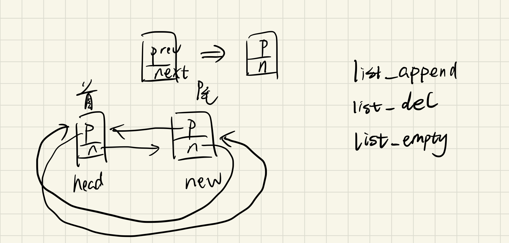

# 设计报告

## 多分区调度

### 设计

POK原有的分区调度模型为同一时刻整个系统内只有一个分区处于运行状态，各分区之间通过WRR调度（**为POK原有功能，因此无需再重复实现**），所有分区及它们的权重均在编译期静态声明，例如通过`config.yaml`:

```yaml
kernel:
    features: [debug]
    scheduler:
        major_frame: 53s
        slots:
            - partition: pr1
              duration: 2s
            - partition: pr2
              duration: 40s
            - partition: pr1
              duration: 1s
            - partition: pr2
              duration: 10s
```

这样的设计可以保证不同分区之间的时间隔离，但与此同时，也让实现多分区之间的抢占式优先级或EDF调度没有意义，因为各分区的优先级并不存在动态的变化，也不存在任务的动态产生。为了实现多分区抢占式优先级和EDF调度，我们修改了分区的调度模型以及配置文件格式，让每个分区也可以指定优先级、周期、周期内完成时间及deadline，如下所示：

```yaml
kernel:
    features: [debug, debug_part]
    partition_sched: fp
    scheduler:
        slots:
            - partition: pr1
              period: 10s
              complete_time: 4s
              deadline: 10s
              priority: 1
            - partition: pr2
              period: 2s
              complete_time: 1s
              deadline: 2s
              priority: 2
```

通过设置`partition_sched`属性为`fp`或`edf`，即可选择多分区抢占式优先级或EDF调度，同时使用我们修改后的分区调度模型。若不设置该属性，则分区调度仍为POK原有模型。

### 实现

目前POK在x86-qemu平台上只使用1个CPU核心，此外，从其中断处理函数prologue可以看到：

```c
#define INTERRUPT_HANDLER(name)                                                \
  void name(void);                                                             \
  void name##_handler(interrupt_frame *frame);                                 \
  asm(".global " #name "			\n"                                                 \
      "\t.type " #name ",@function	\n" #name                              \
      ":				\n"                                                                \
      "cli			\n"                                                               \
      "subl $4, %esp			\n"                                                     \
      "pusha				\n"                                                            \
      "push %ds				\n"                                                         \
      "push %es				\n"                                                         \
      "push %esp			\n"                                                         \
      "mov $0x10, %ax			\n"                                                    \
      "mov %ax, %ds			\n"                                                      \
      "mov %ax, %es			\n"                                                      \
      "call " #name "_handler		\n"                                             \
      "call update_tss			\n"                                                   \
      "addl $4, %esp			\n"                                                     \
      "pop %es				\n"                                                          \
      "pop %ds				\n"                                                          \
      "popa				\n"                                                             \
      "addl $4, %esp			\n"                                                     \
      "sti			\n"                                                               \
      "iret				\n");                                  \
  void name##_handler(interrupt_frame *frame)
```

在跳转到中断处理函数前，通过`cli`指令关闭了中断，此外，从POK IDT定义中可以看到：

```c
pok_ret_t pok_exception_init() {
  int i;

  for (i = 0; exception_list[i].handler != NULL; ++i) {
    pok_idt_set_gate(exception_list[i].vector, GDT_CORE_CODE_SEGMENT << 3,
                     (uint32_t)exception_list[i].handler, IDTE_INTERRUPT, 3);
  }

  return (POK_ERRNO_OK);
}
```

即所有同步异常的IDT均被设为`IDTE_INTERRUPT`，对于此类型IDT，CPU在调用前默认关闭中断。因此，在x86-qemu平台上，POK在内核态运行时不存在并发，所有内核态代码可以认为是原子执行。故只需要在每次触发调度逻辑时，选择一个新的分区来执行，即可实现分区的抢占。具体地，POK原有的调度逻辑如下：

```c
void pok_global_sched() {
  uint8_t elected_partition = POK_SCHED_CURRENT_PARTITION;
  elected_partition = pok_elect_partition();
  new_partition = elected_partition != POK_SCHED_CURRENT_PARTITION;
  POK_SCHED_CURRENT_PARTITION = elected_partition;

  if (multiprocessing_system) {
    start_rendezvous(&fence);
    pok_send_global_schedule_thread();
  }
  pok_global_sched_thread(TRUE);
}
```

我们所实现的分区调度逻辑只需要在需要抢占时，通过`pok_elect_partition`返回新的分区id，即可完成分区的抢占。

为了与POK原有分区调度逻辑兼容，我们将配置文件中的新增配置转换为多个`deployment.h`中的配置宏，在POK原有分区调度函数中，通过条件编译加入我们的hook：

```c
uint8_t pok_elect_partition() {
  uint8_t next_partition = POK_SCHED_CURRENT_PARTITION;
#if POK_CONFIG_NB_PARTITIONS > 1
  uint64_t now = POK_GETTICK();
  pok_sched_flushports(now);
#if !defined (POK_NEEDS_PRIO_PART_SCHED)
  if (pok_sched_next_deadline <= now) {
    /* Here, we change the partition */

    pok_sched_current_slot =
        (pok_sched_current_slot + 1) % POK_CONFIG_SCHEDULING_NBSLOTS;
    pok_sched_next_deadline =
        pok_sched_next_deadline + pok_sched_slots[pok_sched_current_slot];
    /*
        *  FIXME : current debug session about exceptions-handled
          printf ("Switch from partition %d to partition %d\n",
       pok_current_partition, pok_sched_current_slot); printf ("old current
       thread = %d\n", POK_SCHED_CURRENT_THREAD);

          printf ("new current thread = %d\n",
       CURRENT_THREAD(pok_partitions[pok_sched_current_slot])); printf ("new
       prev current thread = %d\n",
       pok_partitions[pok_sched_current_slot].prev_thread);
          */
    next_partition = pok_sched_slots_allocation[pok_sched_current_slot];
  }
#else
  next_partition = pok_partition_prio_sched(now);
#endif /* defined (POK_NEEDS_PRIO_PART_SCHED) */
#endif /* POK_CONFIG_NB_PARTITIONS > 1 */

  return next_partition;
}
```

如果在`config.yaml`中设置了`kernel.partition_sched`属性，则会生成`POK_NEEDS_PRIO_PART_SCHED`宏，将控制流跳转到我们新增的`pok_partition_prio_sched`函数。由于FP与EDF均属于基于优先级的调度，因此我们把它们统一到一个hook入口中。`pok_partition_prio_sched`及我们实现的其他分区调度逻辑在`kernel/core/partition_sched.c`中。

由于POK原有分区数据结构并不具备我们修改后的分区调度模型所需的成员，因此我们采用与POK中其他数据结构类似的静态声明和初始化方法，在`partition_sched.c`中声明分区调度所需的数据结构：

```c
/**
 * @brief represents attributes of partitions which have been declared in 
 * configurations(config.yaml or deployment.h).
 * 
 */
typedef struct {
    uint64_t period;
    uint64_t complete_time;
    uint64_t deadline;
#if POK_CONFIG_PRIO_PART_SCHED == PART_SCHED_FP
    uint64_t prio;
#endif
} pok_partition_prio_attr_t;

/**
 * @brief represents a running instance of a partition. A partition has only
 one corresponding instance at any time. 
 * 
 * This instance may be runnable or non-runnable. Because we employ a periodic
 * model for partitions too, a partition would issue a "new instance" at the
 * beginning of each period. During a period, if this instance has not run out
 * of its time(complete_time in pok_partition_prio_attr_t), it would be consider-
 * ed as runnable. Otherwise, it's non-runnable. There are two possible scenarios
 * where an instance would be non-runnable. The first one is that an instance 
 * has completed its job in a period. The other one is that an instance is not done,
 * but it has passed its deadline when period > deadline.
 * 
 */
typedef struct {
    bool_t runnable;
    uint64_t next_arrival_time;
    uint64_t next_deadline;
    uint64_t last_sched_time;
    /* run time in a period, get cleared in a new period */
    uint64_t run_time;
} pok_partition_instance_t;

pok_partition_prio_attr_t pok_part_prio_attrs[POK_CONFIG_NB_PARTITIONS] = POK_CONFIG_PARTITIONS_PRIO_ATTRS;

pok_partition_instance_t pok_part_instances[POK_CONFIG_NB_PARTITIONS] = {0};
```

其中，`pok_partition_prio_attr_t`用于存储一个分区在配置文件中声明的分区调度相关属性，而`pok_partition_instance_t`则表示一个分区当前的运行实例，包括该分区的下一个周期的开始时间、下一个deadline、上一次被调度的时间，及当前周期内的运行时间。我们修改了`misc/gen_deployment`脚本，使其根据`config.yaml`中的内容生成`pok_part_prio_attrs`的初始化定义`POK_CONFIG_PARTITIONS_PRIO_ATTRS`。

分区调度的核心逻辑由`pok_partition_prio_sched_core`函数实现，该函数每次被调用时，首先检查当前时刻是否有某个分区进入了新的运行周期，只有此时，所有可运行分区间的优先级排序可能发生改变，抢占可能发生；否则，检查当前运行的分区是否已经完成运行或超过了它在本次周期内的deadline。若上述任意条件满足，调用`pok_partition_prio_elect`函数选择新的分区供运行，并调用`pok_partition_post_elect`更新新的分区所对应的实例状态。

如前所述，EDF和FP本质上都属于基于优先级的调度策略，因此我们通过`pok_partition_prio_sched_core`函数封装了大部分公共的调度逻辑，仅在选择下一个分区时，二者存在差异。在`pok_partition_prio_elect`函数中，我们根据`POK_CONFIG_PRIO_PART_SCHED`配置宏将控制流转发到EDF或FP调度函数，它们分别根据每个实例的`next_deadline`或每个分区的`prio`选择需要运行的分区。

```c
#if POK_CONFIG_PRIO_PART_SCHED == PART_SCHED_FP
static uint8_t pok_partition_fp_elect(void) {
    uint8_t elected_partition = POK_SCHED_CURRENT_PARTITION, cur_partition;
    pok_partition_instance_t *cur_instance, *elected_instance = &pok_part_instances[elected_partition];

    for (cur_partition = 0; cur_partition < POK_CONFIG_NB_PARTITIONS; cur_partition++) {
        cur_instance = &pok_part_instances[cur_partition];

        if (cur_instance->runnable) {
            if (!elected_instance->runnable) {
                elected_partition = cur_partition;
                elected_instance = cur_instance;
                continue;
            }

            if (pok_part_prio_attrs[cur_partition].prio > pok_part_prio_attrs[elected_partition].prio) {
                elected_partition = cur_partition;
                elected_instance = cur_instance;
            }
        }
    }

    return elected_partition;
}
#endif

#if POK_CONFIG_PRIO_PART_SCHED == PART_SCHED_EDF
static uint8_t pok_partition_edf_elect(void) {
    uint8_t elected_partition = POK_SCHED_CURRENT_PARTITION, cur_partition;
    pok_partition_instance_t *elected_instance = &pok_part_instances[elected_partition], *cur_instance;

    for (cur_partition = 0; cur_partition < POK_CONFIG_NB_PARTITIONS; cur_partition++) {
        cur_instance = &pok_part_instances[cur_partition];

        if (cur_instance->runnable) {
            if (!elected_instance->runnable) {
                elected_partition = cur_partition;
                elected_instance = cur_instance;
                continue;
            }

            if (cur_instance->next_deadline < elected_instance->next_deadline) {
                elected_partition = cur_partition;
                elected_instance = cur_instance;
            }
        }
    }

    return elected_partition;
}
#endif
```

## 多线程调度

为了实现新的线程调度算法，我们添加了新的`pok_sched_t`类型。根据程序的设置，调度函数会将partition的`sched_func`设置为对应的调度函数。

线程调度实验环境预设。POK的实现中对于线程的time-capacity的处理有问题，在当前线程remaining_time_capacity用完后，应进入 POK_STATE_WAIT_NEXT_ACTIVATION 状态，等待周期结束重新激活（即填充remaining_time_capacity），但函数 pok_elect_thread()原有逻辑有误，导致永远无法进入 POK_STATE_WAIT_NEXT_ACTIVATION 状态。原实现如下：

```c
if ((POK_SCHED_CURRENT_THREAD != IDLE_THREAD) &&
    (POK_SCHED_CURRENT_THREAD != POK_CURRENT_PARTITION.thread_main) &&
    (POK_SCHED_CURRENT_THREAD != POK_CURRENT_PARTITION.thread_error)) {
    if (POK_CURRENT_THREAD.remaining_time_capacity > 0) {
    POK_CURRENT_THREAD.remaining_time_capacity =
        POK_CURRENT_THREAD.remaining_time_capacity - 1;
    } else if (POK_CURRENT_THREAD.time_capacity >
                0) // Wait next activation only for thread
                // with non-infinite capacity (could be
                // infinite with value -1 <--> INFINITE_TIME_CAPACITY)
    {
    POK_CURRENT_THREAD.state = POK_STATE_WAIT_NEXT_ACTIVATION;
    }
}
```

我们尝试在调度策略中维护，但在上层函数逻辑错误的情况下无法解决本质问题，除非破坏time-capacity准确语义。于是修改后的代码如下：

```c
if ((POK_SCHED_CURRENT_THREAD != IDLE_THREAD) &&
    (POK_SCHED_CURRENT_THREAD != POK_CURRENT_PARTITION.thread_main) &&
    (POK_SCHED_CURRENT_THREAD != POK_CURRENT_PARTITION.thread_error)) {
    if (POK_CURRENT_THREAD.remaining_time_capacity > 0) {
    POK_CURRENT_THREAD.remaining_time_capacity =
        POK_CURRENT_THREAD.remaining_time_capacity - 1;
    }
    if (POK_CURRENT_THREAD.remaining_time_capacity == 0 &&
    POK_CURRENT_THREAD.time_capacity >
                0) // Wait next activation only for thread
                // with non-infinite capacity (could be
                // infinite with value -1 <--> INFINITE_TIME_CAPACITY)
    {
    POK_CURRENT_THREAD.state = POK_STATE_WAIT_NEXT_ACTIVATION;
    }
}
```

下面将依次介绍线程调度策略的设计实现。

### 抢占式优先级调度

使用`pok_sched_part_prio`函数执行抢占式优先级调度。

```c
uint32_t pok_sched_part_prio(const uint32_t index_low, const uint32_t index_high, const uint32_t prev_thread,
                                 const uint32_t current_thread) {
    return select_thread_by_property(priority_cmp, index_low, index_high, prev_thread, current_thread);
}

static uint32_t select_thread_by_property(thread_comparator_fn property_cmp, const uint32_t index_low,
                                          const uint32_t index_high, const uint32_t prev_thread,
                                          const uint32_t current_thread) {
    uint32_t start, iter, thread;
    uint32_t max_property_thread = IDLE_THREAD;

    if (current_thread == IDLE_THREAD) {
      start = prev_thread;
    } else {
      start = current_thread;
    }

    for (iter = 0; iter < index_high - index_low; iter++) {
      thread = (start + iter) % (index_high - index_low);
      if (pok_threads[thread].state == POK_STATE_RUNNABLE &&
          property_cmp(thread, max_property_thread) > 0) {
        max_property_thread = thread;
      }
    }

    return max_property_thread;
}
```

`select_thread_by_property`函数会循环遍历从`index_low`到`index_high`的线程，找出其中优先级最高的线程。其中`priority_cmp`函数选出`priority`更大的线程，具体实现如下：

```c
static int priority_cmp(uint32_t t1, uint32_t t2) {
    return pok_threads[t1].priority - pok_threads[t2].priority;
}
```

### 抢占式 EDF 调度

使用`pok_sched_part_edf`函数抢占式 EDF 调度，与1.1的框架类似，

```c
uint32_t pok_sched_part_edf(const uint32_t index_low, const uint32_t index_high, const uint32_t prev_thread,
                                const uint32_t current_thread) {
    return select_thread_by_property(deadline_cmp, index_low, index_high, prev_thread, current_thread);
}
```

`deadline_cmp`函数挑选deadline更大的线程，具体实现如下：

```c
static int deadline_cmp(uint32_t t1, uint32_t t2) {
    /* Handle threads that don't have deadlines */
    if (pok_threads[t1].deadline == 0) return -1;
    if (pok_threads[t2].deadline == 0) return 1;
    /* Select the thread with earliest deadline */
    return pok_threads[t2].current_deadline - pok_threads[t1].current_deadline;
}
```

### Round-Robin 调度

POK原来的RR调度实现实际上不是 Round-Robin，只能说是当一个的`time-capacity`在一个周期内用完后调度下一个。`time-capacity`表示在周期内最多占用的时间量，可以用来模拟计算时间确定的周期性任务，当`time-capacity`用完时表示该任务完成。因此原来的调度与基于任务创建时间先后的优先级调度类似。

我们实现了真正的 Round-Robin 调度，使用`pok_sched_part_real_rr()`函数进行调度，对应于kernel配置中的`POK_SCHED_REAL_RR`调度设置。为实现RR调度，我们在线程结构体中加入了剩余时间片数（`rr_budget`，时间片即连续两次调度的时间间隔，我们定义为 20 `tick`），如下：

```c
typedef struct {
  uint8_t priority;
  int64_t period;
  uint64_t deadline;
  uint64_t current_deadline;
  int64_t time_capacity;
  int64_t remaining_time_capacity;
  uint64_t rr_budget;   // remain time slice number
  ...
} pok_thread_t;
```

`pok_sched_part_real_rr()`函数与POK原有的调度函数形式类似，但额外在该函数中维护了每个线程（即任务）的剩余时间片。首先结算先前被调度的线程的剩余时间片，再从该线程开始，在可调度线程中选取第一个剩余时间片不为0的线程。若遇到剩余时间片为0的线程，则恢复它的剩余时间片数，并跳过。

```c
uint32_t pok_sched_part_real_rr(const uint32_t index_low, const uint32_t index_high,
                                const uint32_t prev_thread,
                                const uint32_t current_thread) {
    uint32_t elected;
    uint32_t from;
    bool_t exist_one = FALSE;
    uint8_t current_proc = pok_get_proc_id();

    if (current_thread == IDLE_THREAD) {
        elected = (prev_thread != IDLE_THREAD) ? prev_thread : index_low;
    } else {
        if (pok_threads[current_thread].rr_budget > 0) {
            pok_threads[current_thread].rr_budget--;
        }
        elected = current_thread;
    }

    from = elected;

    do {
        if ((pok_threads[elected].remaining_time_capacity > 0 ||
            pok_threads[elected].time_capacity == INFINITE_TIME_VALUE) &&
            pok_threads[elected].state == POK_STATE_RUNNABLE &&
            pok_threads[elected].processor_affinity == current_proc) {
            // At least one thread can be scheduled under other conditions
            exist_one = TRUE;

            if (pok_threads[elected].rr_budget > 0) {
                break;
            } else {
                pok_threads[elected].rr_budget = POK_LAB_SCHED_RR_BUDGET;
            }
        }
        elected++;
        if (elected >= index_high) {
            elected = index_low;
        }
    } while (elected != from || exist_one);

    if (!exist_one) {
        elected = IDLE_THREAD;
    }
    return elected;
}
```

### Weighted-Round-Robin 调度

带权的Round-Robin基于Round-Robin很容易实现，只需在线程中维护`weight`成员，以此来初始化和重置`rr_budget`即可。线程结构如图所示：

```c
typedef struct {
  uint8_t priority;
  int64_t period;
  uint64_t deadline;
  uint64_t current_deadline;
  int64_t time_capacity;
  int64_t remaining_time_capacity;
  uint64_t rr_budget;
  uint64_t weight;
  ...
}
```

使用`pok_sched_part_wrr()` 函数进行调度，代码如下：

```c
uint32_t pok_sched_part_wrr(const uint32_t index_low, const uint32_t index_high,
                                const uint32_t prev_thread,
                                const uint32_t current_thread) {
    uint32_t elected;
    uint32_t from;
    bool_t exist_one = FALSE;
    uint8_t current_proc = pok_get_proc_id();

    if (current_thread == IDLE_THREAD) {
        elected = (prev_thread != IDLE_THREAD) ? prev_thread : index_low;
    } else {
        if (pok_threads[current_thread].rr_budget > 0) {
            pok_threads[current_thread].rr_budget--;
        }
        elected = current_thread;
    }

    from = elected;

    do {
        if ((pok_threads[elected].remaining_time_capacity > 0 ||
            pok_threads[elected].time_capacity == INFINITE_TIME_VALUE) &&
            pok_threads[elected].state == POK_STATE_RUNNABLE &&
            pok_threads[elected].processor_affinity == current_proc) {
            // At least one thread can be scheduled under other conditions
            exist_one = TRUE;

            if (pok_threads[elected].rr_budget > 0) {
                break;
            } else {
                pok_threads[elected].rr_budget = pok_threads[elected].weight * POK_LAB_SCHED_RR_BUDGET;
            }
        }
        elected++;
        if (elected >= index_high) {
            elected = index_low;
        }
    } while (elected != from || exist_one);

    if (!exist_one) {
        elected = IDLE_THREAD;
    }
    return elected;
}
```

## 动态线程创建

`POK_CONFIG_PARTITIONS_NTHREADS` 表示所有分区对应的总的线程控制块数量，POK的线程数量本身是确定的，不能更改的，这是因为线程控制块所在的数组是静态声明的，而不是动态分配的。换句话说，线程数量有上限。因此，为了避免线程创建系统调用的误用，在系统调用处理函数`pok_partition_thread_create()`中，当分区状态已为`NORMAL`时，不予创建并返回创建失败，如下所示：

```c
if ((pok_partitions[partition_id].mode != POK_PARTITION_MODE_INIT_COLD) &&
    (pok_partitions[partition_id].mode != POK_PARTITION_MODE_INIT_WARM)) {
    return POK_ERRNO_MODE;
}
```

实际上，未初始化的线程控制块本身状态为 `POK_STATE_STOPPED`，不参与调度，不影响正确性。因此只要我们使用`POK_CONFIG_PARTITIONS_NTHREADS` 预留足够的空间，并在线程创建系统调用中允许创建线程、正常初始化线程即可。
为了不侵入修改已有逻辑，我们专为动态创建的情况作判断，已完成特殊处理。在`pok_thread_attr_t` 引入了一个新的属性 `dynamic_created`，表示为动态创建的线程。

```c
typedef struct {
  uint8_t priority; /* Priority is from 0 to 255 */
  uint8_t processor_affinity;
  void *entry; /* entrypoint of the thread  */
  uint64_t period;
  uint64_t weight;
  uint64_t deadline;
  uint64_t time_capacity;
  uint32_t stack_size;
  pok_state_t state;
  bool_t dynamic_created;
} pok_thread_attr_t;
```

同时在 `pok_partition_thread_create()` 做判断：

```c
if (!attr->dynamic_created &&
    (pok_partitions[partition_id].mode != POK_PARTITION_MODE_INIT_COLD) &&
    (pok_partitions[partition_id].mode != POK_PARTITION_MODE_INIT_WARM)) {
return POK_ERRNO_MODE;
}
```

经测试无误，详见测试报告。

## 多级反馈队列调度算法

我们使用 Python 实现了 MLFQ 算法，同时用 C 语言在 POK 中实现了 MLFQ 调度策略支持。下面将首先介绍 MLFQ 算法，提出设计规约，之后分别介绍 Python 以及 POK 中的实现。

### 算法简述

随着计算机的发展，操作系统中任务的需求变得越来越复杂，任务可能同时希望有较低的周转时间和响应时间，并且任务的运行时间无法预知。RR、STCF（Shortest Time-to-Completion First）等等调度算法都无法满足上述需求。

MLFQ 算法（Multi-Level Feedback Queue）策略的设计目标是，在无法预知任务信息且任务类型动态变化（任务行为模式会在计算密集型与I/O密集型间切换）的场景下，既能达到类似STCF策略的周转时间，又能像RR策略一样尽可能降低任务的响应时间。为此，MLFQ在多级队列的基础上，增加了动态设置任务优先级的策略。

MLFQ 算法维护了多个队列，代表不同优先级。算法采取不同队列优先级不同，优先执行高优先级队列内的任务，同一队列中任务轮转的方式。优先级的动态设置基于“短任务拥有更高的优先级”的原则，通过在运行时给每个任务的执行时间计时，每达到一定阈值（即执行时间较长）时使该任务降级，实现了优先级分配的动态、合理。为了避免任务类型在运行过程中的转换，如长任务变成I/O密集型任务或短任务，MLFQ还会每隔一段时间，将所有未完成任务加入最高优先级队列重新开始评估。

MLFQ 算法总结下来遵循以下 6 条规则：

1. 如果两个任务在不同优先级队列，优先运行优先级高的队列的任务，支持抢占式调度（基本规则）
2. 如果任务处于同一优先级，则退化为 RR 调度（基本规则）
3. 任务到来时处于最高优先级（公平调度）
4. 当某一任务的执行时间达到其所在队列的最大运行时间后，任务进入下一优先级的队列（动态优先级分配，Penalty）
5. 经过一段时间之后，把所有未做完的工作重新加入最高优先级的队列（动态优先级分配，Boost）
6. 高优先级队列中任务轮转的时间片短，低优先级队列任务轮转的时间片长（减少长任务切换次数）

以下示例场景用于展示MLFQ策略的效果，系统中共有三个任务，任务1、2、3在图中分别用黑色、蓝色和红色表示。其中任务1、2为周期性任务，周期为10s，任务1完成需要的时间为2s，任务2完成需要4s。任务3为长期批处理任务。

图中描述了各任务所在的队列及执行情况，开始时，任务1、2、3均处在最高优先级队列（即队列0），以RR方式执行两轮后，任务1完成，任务2、3进入队列1执行，任务2执行一个轮转时间片后也完成。在10s时，任务1、2在新的周期进入调度，以RR方式执行，两轮后任务1结束，任务2进入队列1。任务3在此后才被调度，再执行一个轮转时间片后进入队列2（最低优先级）。直到30s时，触发Boost，所有任务又重新进入队列0中。


以MLFQ为基础的调度策略在很多操作系统中都得到了应用，例如早期的linux、Windows和macOS。

### 使用 Python 实现的 MLFQ 算法模拟简述

我们使用Python实现了MLFQ调度算法，在源码目录`/mlfq_python_impl`下。我们的实现基于开源的调度模拟器框架，该框架与单核简单模拟相比，较为完备，它能够模拟多核调度，并能模拟线程间因共享资源（如内存、I/O均抽象为系统资源，最多支持三类）导致的CPU空闲，能统计总的CPU时间和CPU利用率。我们为其增加了MLFQ调度策略并进行了简单测试。

具体而言，代码实现主要是两部分。一部分是调度策略函数，负责下一个被调度任务的选取，之后创建线程模拟执行消耗CPU时间，在`/mlfq_python_impl/schedulers.py`中，如下所示：

```python
def multilevel_feedback_queue(tasks_count, queues_number, queues_time_quantum, queue_time_slice):
    queues = []
    for i in range(queues_number):
        queues.append([])
    queues[0] = globals.ready
    queue_index = 0
    threads = []
    tasks = globals.ready.copy()
    counter = 0
    while globals.get_done_tasks_count(tasks) < tasks_count:
        isDone = True
        if len(globals.waiting) > 0:
            task, queue_index = globals.waiting[0]
            isDone = False
        else:
            for i in range(queues_number):
                if len(queues[i]) > 0:
                    task = queues[i][0]
                    queue_index = i
                    isDone = False
                    break
        counter += 1
        if not isDone:
            if hasEnoughResources(task, globals.resources):
                while(not task.get_isAssigned()):
                    for core in globals.cpu_cores:
                        if core.get_state() == 'idle':
                            core.set_state('busy')
                            core.set_running_task(task)

                            next_level_queue_indx = min(queue_index+1, queues_number-1)
                            current_state = 'queue ' + str(queue_index)
                            next_state = 'queue ' + str(next_level_queue_indx)
                            th = Thread(target=core.process_task, args=(task, globals.resources, globals.cpu_cores, \
                                queues_time_quantum[queue_index], queue_time_slice[queue_index],queues[next_level_queue_indx], next_state, queues[queue_index], current_state))
                            task.set_isAssigned(True)

                            isWaiting = True
                            for i in range(queues_number):
                                if task in queues[i]:
                                    queues[i].pop(0)
                                    isWaiting = False
                            if isWaiting:
                                globals.waiting.pop(0)
                            th.start()
                            threads.append(th)
                            break
            else:
                isWaiting = True
                for i in range(queues_number):
                    if task in queues[i]:
                        queues[i].pop(0)
                        isWaiting = False
                if isWaiting:
                    globals.waiting.pop(0)

                globals.waiting.append((task, queue_index))

    globals.join_threads(threads)
    globals.print_cpu_cores_consumed_time(globals.cpu_cores)
    exit(0)
```

我们考虑是否存在先前因资源争用等待的任务，如果没有，则选择最高优先级的非空队列中任务作为下一个调度对象。当它满足其他调度条件时，并创建任务线程，将其从队列中移除。

下面将展示任务线程的过程，在`cpuCore.py`中：

```python
    def process_task(self, task, resources, cpu_cores, time_quantum=None, time_slice=None,      queue=None, state='ready', origin_queue=None, origin_state='queue 0'):

        task.set_state('running')
        task.allocate_resources(resources)

        # indicates the selected scheduler
        # algorithm is non-preemptive
        if time_quantum == None:
            for _ in range(task.duration):
                time.sleep(1)
                # print_system_status(cpu_cores, resources)
                task.increment_cpu_time()
                self.idle_time += 1
                globals.increment_system_total_time()

            task.set_state('done')
            task.free_resources(resources)

        else:
            remain_time = task.duration - task.cpu_time
            for _ in range(min(remain_time, time_slice)):
                time.sleep(1)
                # print_system_status(cpu_cores, resources)
                task.increment_cpu_time()
                task.queue_time += 1
                self.idle_time += 1
                globals.increment_system_total_time()

            task.free_resources(resources)
            if task.cpu_time == task.duration:
                task.set_state('done')

            else:
                if task.queue_time == time_quantum:
                    task.queue_time = 0
                    task.set_state(state)
                    task.set_isAssigned(False)
                    with globals.task_mutex:
                        queue.append(task)
                else:
                    task.set_state(origin_state)
                    task.set_isAssigned(False)
                    with globals.task_mutex:
                        origin_queue.append(task)

        print()
        globals.task_mutex.acquire(blocking=False)
        globals.resource_mutex.acquire(blocking=False)
        print(colored('Task ' + task.name + ' current cputime: ', 'yellow')+ str(task.cpu_time) \
            + '\n' + colored('Task ' + task.name + ' current state: ' , 'yellow')+ task.state)
        globals.task_mutex.release()
        globals.resource_mutex.release()
        self.set_state('idle')
        self.set_running_task(None)
```

该线程会计算执行时间，并sleep需要的执行时间，模拟CPU计算用时。在执行完成后，根据MLFQ的要求重新加入指定的多级调度队列。

### 在 POK 中支持 MLFQ 调度策略

由上节中对MLFQ调度策略的介绍可知，首先我们要维护多队列。每个队列需要指定用户可配置的“优先级”、“队列内最大可运行时间”以及“队列内不同任务轮转的时间片”作为队列的元数据。同时每个任务分散在不同队列中，在选取下一个被调度的任务时，可根据优先级从低到高遍历队列，找到非空队列并索引到队列中的第一个线程。这就要求队列以数组或链表的形式组织线程结构。

由于pok中本来没有链表支持，因此我们引入了内核中常用的双向链表库，可将对象通过链表节点成员链接起来。代码位于`kernel/common/`目录下，包括`list.h`，`macro.h`，`types.h`。`list.h`的部分核心代码如下：

```c
struct list_head {
	struct list_head *prev;
	struct list_head *next;
};

static inline void init_list_head(struct list_head *list)
{
	list->next = list;
	list->prev = list;
}

static inline void list_add(struct list_head *new, struct list_head *head)
{
	new->next = head->next;
	new->prev = head;
	head->next->prev = new;
	head->next = new;
}

static inline void list_append(struct list_head *new, struct list_head *head)
{
	struct list_head *tail = head->prev;
	return list_add(new, tail);
}

static inline void list_del(struct list_head *node)
{
	node->prev->next = node->next;
	node->next->prev = node->prev;
}

static inline bool list_empty(struct list_head *head)
{
	return (head->prev == head && head->next == head);
}
```

以上代码构造了如下图所示的双链表，支持在尾部插入节点、删除节点、判空等操作：



在此基础上，我们在`kernel/include/core/sched.h`中定义了队列结构以及多级队列的默认参数，并在`kernel/core/sched.c`中声明了全局的多级队列变量。如下代码所示：

```c
#if !defined(QUEUE_NUM) || !defined(QUEUE_TIME_SLICE) || !defined(QUEUE_TIME_ALLOTMENT) || !defined(BOOST_INTERVAL)
#define QUEUE_NUM               3
#define QUEUE_TIME_SLICE        { 1, 2, 4 }
#define QUEUE_TIME_ALLOTMENT    { 2, 4, 8 }
#define BOOST_INTERVAL          30
#endif

typedef struct {
    uint64_t time_slice;
    uint64_t time_allotment;
    struct list_head list;
} feedback_queue_t;
```

```c
feedback_queue_t mlfq[POK_CONFIG_NB_PROCESSORS][QUEUE_NUM];
```

值得注意的是，多级队列是面向每个处理器核维护的，即共有`POK_CONFIG_NB_PROCESSORS`个多级队列，每个多级队列包含用户可配置的`QUEUE_NUM`个队列。此外，`QUEUE_TIME_SLICE`表示队列内轮转时间片，通常低优先级的队列时间片大，`QUEUE_TIME_ALLOTMENT`表示队列内一个任务最长执行时间。

接下来，根据算法说明，需要评估任务在当前队列中已经执行的时间，每当整除队列的轮转时间片时需要调度队列内其他任务，超出最长执行时间后需降到低优先级队列。除此之外，我们需要将线程结构体通过链表节点串联到队列中，并标记其所在的队列号。因此我们在线程结构体中添加了`tick`，`queue_node`，`queue_id`成员，其中`tick`的单位为调度间隔。如下：

```c
typedef struct {
  uint8_t priority;
  int64_t period;
  uint64_t deadline;
  uint64_t current_deadline;
  int64_t time_capacity;
  int64_t remaining_time_capacity;
  uint64_t rr_budget;
  uint64_t weight;
  uint64_t tick;
  struct list_head queue_node;
  uint64_t queue_id;
  ...
}
```

我们的调度策略实现函数是`pok_sched_part_mlfq()`，整体流程包括结算当前线程的`tick`，判断是否需要调度，以及做调度。在调度次数累计达`BOOST_INTERVAL`的倍数时，需要做Boost将所有任务加入最高优先级队列。可见用链表结构做RR调度可以简化实现，同时在O(1)时间内完成操作。如下：

```c
uint32_t pok_sched_part_mlfq(const uint32_t index_low, const uint32_t index_high,
                                const uint32_t prev_thread,
                                const uint32_t current_thread) {
    uint32_t elected;
    static uint32_t sched_time = 0;
    uint64_t q_id, next_q_id;
    // SQY: Fix me! this assignment operation just for avioding error from '-Werror=unused-parameter'
    pok_thread_t *thread = &pok_threads[prev_thread];
    bool_t exist_one = FALSE;
    uint8_t current_proc = pok_get_proc_id();
    printf("SQY@%s trace: %d, ready for queue moving. \r\n", __func__, __LINE__);

    if (current_thread != IDLE_THREAD) {
        q_id = pok_threads[current_thread].queue_id;

        pok_threads[current_thread].tick++;
        if (pok_threads[current_thread].tick >= mlfq[current_proc][q_id].time_allotment) {
            // move to lower queue
            next_q_id = q_id == (QUEUE_NUM - 1) ? q_id : q_id + 1;
            list_del(&(pok_threads[current_thread].queue_node));
            list_append(&(pok_threads[current_thread].queue_node), &(mlfq[current_proc][next_q_id].list));
            pok_threads[current_thread].queue_id = next_q_id;
            // tick is counter for time_allotment, clear here
            pok_threads[current_thread].tick = 0;
        } else if (pok_threads[current_thread].tick % mlfq[current_proc][q_id].time_slice == 0) {
            // dequeue and enqueue again
            list_del(&(pok_threads[current_thread].queue_node));
            list_append(&(pok_threads[current_thread].queue_node), &(mlfq[current_proc][q_id].list));
        }
    }

    sched_time++;
    // Boost for every BOOST_INTERVAL
    if (sched_time % BOOST_INTERVAL == 0){
        for (q_id = 1; q_id < QUEUE_NUM; q_id++) {
            while (!list_empty(&(mlfq[current_proc][q_id].list))) {
                thread = container_of(mlfq[current_proc][q_id].list.next, pok_thread_t, queue_node);
                list_del(&(thread->queue_node));
                list_append(&(thread->queue_node), &(mlfq[current_proc][0].list));
                thread->queue_id = 0;
                thread->tick = 0;
            }
        }
    }

    for (q_id = 0; q_id < QUEUE_NUM; q_id++) {
        printf("SQY@%s q_id: %lld, queue: ", __func__, q_id);
        for_each_in_list(thread, pok_thread_t, queue_node, &(mlfq[current_proc][q_id].list)) {
            printf("%d - ", thread - pok_threads);
            if ((thread->remaining_time_capacity > 0 ||
                thread->time_capacity == INFINITE_TIME_VALUE) &&
                thread->state == POK_STATE_RUNNABLE) {
                // At least one thread can be scheduled under other conditions
                exist_one = TRUE;
                elected = thread - pok_threads;
                break;
            }
        }
        printf("\n");
        if (exist_one) {
            break;
        }
    }

    if (!exist_one) {
        elected = IDLE_THREAD;
    }
    return elected;
}
```

除了上面的策略实现，还需要注意在线程初始化时设`tick`为0，在线程就绪时进入最高优先级队列。而在调度初始化时，需要将多级队列各队列参数设置为用户设置的值。逻辑较为简单，这里不再展示。

还需要额外注意的是，要与POK本身的基于time-capacity的任务状态管理相适应，再每次重新激活加入调度队列时，进入最高优先级队列，在`pok_elect_thread()`中：

```c
...
if ((thread->state == POK_STATE_WAIT_NEXT_ACTIVATION) &&
    (thread->next_activation <= now)) {
    assert(thread->time_capacity);
    thread->state = POK_STATE_RUNNABLE;
    list_del(&(thread->queue_node));
    list_append(&(thread->queue_node), &(mlfq[thread->processor_affinity][0].list));
    thread->queue_id = 0;
    thread->tick = 0;
    thread->remaining_time_capacity = thread->time_capacity;
    thread->next_activation = thread->next_activation + thread->period;
}
...

```

## 新场景调度

### 场景描述
我们寻找了一个工厂流水线次品分拣系统的场景，该场景中，系统需要通过实时监控视频对流水线上的商品进行识别，发现次品并通知机械臂对其进行分拣，还需要为工厂的工作人员提供实时的反馈。

具体而言，系统中包括三项任务：
1. 分拣任务：高优先级，否则次品会超出抓取的范围，导致错过截至时间。分拣失败。
2. 识别任务：中优先级，次品的分拣需要依赖首先对物体进行识别，优先级较高；物体从出现到离开抓取范围有一段的时间，任务可以被打断。
3. 管理任务：低优先级，将系统的实时状态反馈给管理员。

### 算法设计

由于该场景中存在高、中、低三类优先级线程，且高优先级与低优先级线程间存在依赖，因此可以归约为一个典型的存在优先级反转问题的场景。优先级反转指的是高优先级线程与低优先级线程间存在对某个资源的共享关系，且低优先级线程在高优先级线程之前获得了资源的独占访问权的情况。在这一场景下，由于操作系统不理解应用的语义，为了保证应用的正确性，操作系统只能让低优先级线程继续执行，而将高优先级进程休眠，从外界来看，就表现为低优先级线程反而成为了高优先级线程，二者的优先级“反转”了。

上述两类优先级线程间的优先级反转问题从操作系统的角度是无法完全避免的，这是因为操作系统不能改变应用程序的语义。但是，在这样的场景中，高优先级线程被阻塞的时间是可以预测的，即低优先级线程的关键区域长度。然而，一旦还存在优先级位于二者之间的中优先级线程，那么情况则会进一步恶化。由于中优先级线程的优先级高于低优先级线程，所以在前者完成执行前，后者都无法执行；然而，后者却拥有高优先级线程所依赖的资源的独占访问权，所以在存在三类优先级的情况下，一旦发生优先级反转，高优先级线程的阻塞时间将不再是低优先级线程的关键区域时长，而还要加上中优先级线程的运行时间。甚至在特定的场景下，中优先级线程会反复不断运行（因为此时高优先级线程已经休眠，而低优先级线程拥有更低的优先级），则高优先级线程被阻塞的时间将会达到任意长。

从操作系统的角度来看，缓解优先级反转问题，必须解决前述的三种优先级线程下的优先级反转问题。解决这一问题的思路也是非常直观的，既然高优先级线程必须在低优先级线程离开关键区域后才能继续执行，那么就应当让低优先级线程尽可能快地完成其关键区域；而低优先级线程又会被中优先级线程阻塞，所以我们可以临时提高低优先级线程的优先级至高于中优先级线程，让前者可以尽快完成关键区域，从而减少高优先级线程的等待时间。这种临时提高线程优先级的方案被称为优先级置顶（Priority Ceiling）。

我们实现了立即优先级置顶协议（Immediate Priority Ceiling Protocol，IPCP）。具体而言，每个共享资源（在实现中表现为mutex）都需要定义一个置顶值，其值应当设为所有可能竞争该资源的线程中的优先级最高者。当一个线程获得对该资源的独占访问时，**立即**将其优先级提升到该资源的置顶值，并在该线程停止访问该资源时，将其优先级恢复为它原先声明的优先级。

### 算法实现

我们在多线程优先级调度的基础上，实现了防止优先级无限制反转的IPCP算法。在`config.yaml`中，可以选择开启优先级置顶功能，并且需要正确定义每个mutex的置顶值，如下所示：

```yaml
partitions:
    - name: pr1
      features: [timer, console, libc, assert]
      prio_ceiling: true
      mutexes:
          - ceiling: 100
      scheduler: prio
```

如果将`prio_ceiling`属性设为true，则我们修改后的脚本会定义`POK_NEEDS_PRIO_CEILING`宏，从而开启条件编译。在`lockobj.c`中，我们修改mutex的上锁与放锁操作，根据条件调用优先级置顶与复原hook：

```c
#if defined (POK_NEEDS_PRIO_CEILING)
static void pok_lockobj_ceil_current_thread(pok_lockobj_t *obj) {
  pok_threads[POK_SCHED_CURRENT_THREAD].priority = obj->ceiling_value;
  printf("[DEBUG] ceil priority of thread %u to %u, original=%u\n", POK_SCHED_CURRENT_THREAD, obj->ceiling_value, pok_threads[POK_SCHED_CURRENT_THREAD].base_priority);
}

static void pok_lockobj_unceil_current_thread() {
  pok_threads[POK_SCHED_CURRENT_THREAD].priority = pok_threads[POK_SCHED_CURRENT_THREAD].base_priority;
  printf("[DEBUG] unceil priority of thread %u\n", POK_SCHED_CURRENT_THREAD);
}
#endif

pok_ret_t pok_lockobj_lock(pok_lockobj_t *obj,
                           const pok_lockobj_lockattr_t *attr) {
  if (obj->initialized == FALSE) {
    return POK_ERRNO_LOCKOBJ_NOTREADY;
  }
  SPIN_LOCK(obj->spin);

  if (obj->current_value > 0) {
    // Short path: object is available right now
    assert(pok_lockobj_fifo_is_empty(&obj->fifo));
    obj->current_value--;
#if defined (POK_NEEDS_PRIO_CEILING)
    pok_lockobj_ceil_current_thread(obj);
#endif
    SPIN_UNLOCK(obj->spin);
    return POK_ERRNO_OK;
  } else {
    uint64_t deadline =
        attr != NULL && attr->timeout > 0 ? attr->timeout + POK_GETTICK() : 0;
    pok_lockobj_enqueue(&obj->fifo, POK_SCHED_CURRENT_THREAD,
                        obj->queueing_policy);
    if (deadline > 0)
      pok_sched_lock_current_thread_timed(deadline);
    else
      pok_sched_lock_current_thread();

    SPIN_UNLOCK(obj->spin);
    pok_sched_thread(TRUE);
    SPIN_LOCK(obj->spin);

    if ((deadline != 0) && (POK_GETTICK() >= deadline)) {
      pok_lockobj_remove_thread(&obj->fifo, POK_SCHED_CURRENT_THREAD);
      SPIN_UNLOCK(obj->spin);
      return POK_ERRNO_TIMEOUT;
    } else {
#if defined (POK_NEEDS_PRIO_CEILING)
      pok_lockobj_ceil_current_thread(obj);
#endif
      SPIN_UNLOCK(obj->spin);
      return POK_ERRNO_OK;
    }
  }
}

pok_ret_t pok_lockobj_unlock(pok_lockobj_t *obj,
                             const pok_lockobj_lockattr_t *attr) {

  (void)attr; /* unused at this time */

  if (obj->initialized == FALSE) {
    return POK_ERRNO_LOCKOBJ_NOTREADY;
  }
  // Take the lock object internal lock
  SPIN_LOCK(obj->spin);

#if defined (POK_NEEDS_PRIO_CEILING)
    pok_lockobj_unceil_current_thread();
#endif

  /* ... */
}
```

需要注意，一个mutex在上锁时可能有两条得锁路径，即立即得锁或休眠后唤醒得锁，对这两条路径，我们均添加了对`pok_lockobj_ceil_current_thread` hook的调用。