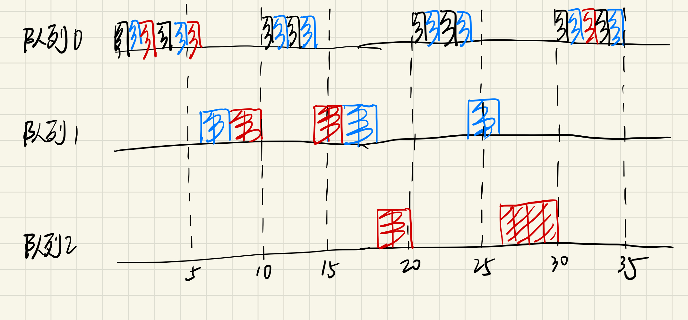

# 设计报告

## 1 多线程调度

为了实现新的线程调度算法，我们添加了新的`pok_sched_t`类型。根据程序的设置，调度函数会将partition的`sched_func`设置为对应的调度函数。

线程调度实验环境预设。POK的实现中对于线程的time-capacity的处理有问题，在当前线程remaining_time_capacity用完后，应进入 POK_STATE_WAIT_NEXT_ACTIVATION 状态，等待周期结束重新激活（即填充remaining_time_capacity），但函数 pok_elect_thread()原有逻辑有误，导致永远无法进入 POK_STATE_WAIT_NEXT_ACTIVATION 状态。原实现如下：

```c
if ((POK_SCHED_CURRENT_THREAD != IDLE_THREAD) &&
    (POK_SCHED_CURRENT_THREAD != POK_CURRENT_PARTITION.thread_main) &&
    (POK_SCHED_CURRENT_THREAD != POK_CURRENT_PARTITION.thread_error)) {
    if (POK_CURRENT_THREAD.remaining_time_capacity > 0) {
    POK_CURRENT_THREAD.remaining_time_capacity =
        POK_CURRENT_THREAD.remaining_time_capacity - 1;
    } else if (POK_CURRENT_THREAD.time_capacity >
                0) // Wait next activation only for thread
                // with non-infinite capacity (could be
                // infinite with value -1 <--> INFINITE_TIME_CAPACITY)
    {
    POK_CURRENT_THREAD.state = POK_STATE_WAIT_NEXT_ACTIVATION;
    }
}
```

我们尝试在调度策略中维护，但在上层函数逻辑错误的情况下无法解决本质问题，除非破坏time-capacity准确语义。于是修改后的代码如下：

```c
if ((POK_SCHED_CURRENT_THREAD != IDLE_THREAD) &&
    (POK_SCHED_CURRENT_THREAD != POK_CURRENT_PARTITION.thread_main) &&
    (POK_SCHED_CURRENT_THREAD != POK_CURRENT_PARTITION.thread_error)) {
    if (POK_CURRENT_THREAD.remaining_time_capacity > 0) {
    POK_CURRENT_THREAD.remaining_time_capacity =
        POK_CURRENT_THREAD.remaining_time_capacity - 1;
    }
    if (POK_CURRENT_THREAD.remaining_time_capacity == 0 &&
    POK_CURRENT_THREAD.time_capacity >
                0) // Wait next activation only for thread
                // with non-infinite capacity (could be
                // infinite with value -1 <--> INFINITE_TIME_CAPACITY)
    {
    POK_CURRENT_THREAD.state = POK_STATE_WAIT_NEXT_ACTIVATION;
    }
}
```

下面将依次介绍线程调度策略的设计实现。

### 1.1 抢占式优先级调度

使用`pok_sched_part_prio`函数执行抢占式优先级调度。

```c
uint32_t pok_sched_part_prio(const uint32_t index_low, const uint32_t index_high, const uint32_t prev_thread,
                                 const uint32_t current_thread) {
    return select_thread_by_property(priority_cmp, index_low, index_high, prev_thread, current_thread);
}

static uint32_t select_thread_by_property(thread_comparator_fn property_cmp, const uint32_t index_low,
                                          const uint32_t index_high, const uint32_t prev_thread,
                                          const uint32_t current_thread) {
    uint32_t start, iter, thread;
    uint32_t max_property_thread = IDLE_THREAD;

    if (current_thread == IDLE_THREAD) {
      start = prev_thread;
    } else {
      start = current_thread;
    }

    for (iter = 0; iter < index_high - index_low; iter++) {
      thread = (start + iter) % (index_high - index_low);
      if (pok_threads[thread].state == POK_STATE_RUNNABLE &&
          property_cmp(thread, max_property_thread) > 0) {
        max_property_thread = thread;
      }
    }

    return max_property_thread;
}
```

`select_thread_by_property`函数会循环遍历从`index_low`到`index_high`的线程，找出其中优先级最高的线程。其中`priority_cmp`函数选出`priority`更大的线程，具体实现如下：

```c
static int priority_cmp(uint32_t t1, uint32_t t2) {
    return pok_threads[t1].priority - pok_threads[t2].priority;
}
```

### 1.2 抢占式 EDF 调度

使用`pok_sched_part_edf`函数抢占式 EDF 调度，与1.1的框架类似，

```c
uint32_t pok_sched_part_edf(const uint32_t index_low, const uint32_t index_high, const uint32_t prev_thread,
                                const uint32_t current_thread) {
    return select_thread_by_property(deadline_cmp, index_low, index_high, prev_thread, current_thread);
}
```

`deadline_cmp`函数挑选deadline更大的线程，具体实现如下：

```c
static int deadline_cmp(uint32_t t1, uint32_t t2) {
    /* Handle threads that don't have deadlines */
    if (pok_threads[t1].deadline == 0) return -1;
    if (pok_threads[t2].deadline == 0) return 1;
    /* Select the thread with earliest deadline */
    return pok_threads[t2].current_deadline - pok_threads[t1].current_deadline;
}
```

### 1.3 Round-Robin 调度

POK原来的RR调度实现实际上不是 Round-Robin，只能说是当一个的`time-capacity`在一个周期内用完后调度下一个。`time-capacity`表示在周期内最多占用的时间量，可以用来模拟计算时间确定的周期性任务，当`time-capacity`用完时表示该任务完成。因此原来的调度与基于任务创建时间先后的优先级调度类似。

我们实现了真正的 Round-Robin 调度，使用`pok_sched_part_real_rr()`函数进行调度，对应于kernel配置中的`POK_SCHED_REAL_RR`调度设置。为实现RR调度，我们在线程结构体中加入了剩余时间片数（`rr_budget`，时间片即连续两次调度的时间间隔，我们定义为 20 `tick`），如下：

```c
typedef struct {
  uint8_t priority;
  int64_t period;
  uint64_t deadline;
  uint64_t current_deadline;
  int64_t time_capacity;
  int64_t remaining_time_capacity;
  uint64_t rr_budget;   // remain time slice number
  ...
} pok_thread_t;
```

`pok_sched_part_real_rr()`函数与POK原有的调度函数形式类似，但额外在该函数中维护了每个线程（即任务）的剩余时间片。首先结算先前被调度的线程的剩余时间片，再从该线程开始，在可调度线程中选取第一个剩余时间片不为0的线程。若遇到剩余时间片为0的线程，则恢复它的剩余时间片数，并跳过。

```c
uint32_t pok_sched_part_real_rr(const uint32_t index_low, const uint32_t index_high,
                                const uint32_t prev_thread,
                                const uint32_t current_thread) {
    uint32_t elected;
    uint32_t from;
    bool_t exist_one = FALSE;
    uint8_t current_proc = pok_get_proc_id();

    if (current_thread == IDLE_THREAD) {
        elected = (prev_thread != IDLE_THREAD) ? prev_thread : index_low;
    } else {
        if (pok_threads[current_thread].rr_budget > 0) {
            pok_threads[current_thread].rr_budget--;
        }
        elected = current_thread;
    }

    from = elected;

    do {
        if ((pok_threads[elected].remaining_time_capacity > 0 ||
            pok_threads[elected].time_capacity == INFINITE_TIME_VALUE) &&
            pok_threads[elected].state == POK_STATE_RUNNABLE &&
            pok_threads[elected].processor_affinity == current_proc) {
            // At least one thread can be scheduled under other conditions
            exist_one = TRUE;

            if (pok_threads[elected].rr_budget > 0) {
                break;
            } else {
                pok_threads[elected].rr_budget = POK_LAB_SCHED_RR_BUDGET;
            }
        }
        elected++;
        if (elected >= index_high) {
            elected = index_low;
        }
    } while (elected != from || exist_one);

    if (!exist_one) {
        elected = IDLE_THREAD;
    }
    return elected;
}
```

### 1.3 Weighted-Round-Robin 调度

带权的Round-Robin基于Round-Robin很容易实现，只需在线程中维护`weight`成员，以此来初始化和重置`rr_budget`即可。线程结构如图所示：

```c
typedef struct {
  uint8_t priority;
  int64_t period;
  uint64_t deadline;
  uint64_t current_deadline;
  int64_t time_capacity;
  int64_t remaining_time_capacity;
  uint64_t rr_budget;
  uint64_t weight;
  ...
}
```

使用`pok_sched_part_wrr()` 函数进行调度，代码如下：

```c
uint32_t pok_sched_part_wrr(const uint32_t index_low, const uint32_t index_high,
                                const uint32_t prev_thread,
                                const uint32_t current_thread) {
    uint32_t elected;
    uint32_t from;
    bool_t exist_one = FALSE;
    uint8_t current_proc = pok_get_proc_id();

    if (current_thread == IDLE_THREAD) {
        elected = (prev_thread != IDLE_THREAD) ? prev_thread : index_low;
    } else {
        if (pok_threads[current_thread].rr_budget > 0) {
            pok_threads[current_thread].rr_budget--;
        }
        elected = current_thread;
    }

    from = elected;

    do {
        if ((pok_threads[elected].remaining_time_capacity > 0 ||
            pok_threads[elected].time_capacity == INFINITE_TIME_VALUE) &&
            pok_threads[elected].state == POK_STATE_RUNNABLE &&
            pok_threads[elected].processor_affinity == current_proc) {
            // At least one thread can be scheduled under other conditions
            exist_one = TRUE;

            if (pok_threads[elected].rr_budget > 0) {
                break;
            } else {
                pok_threads[elected].rr_budget = pok_threads[elected].weight * POK_LAB_SCHED_RR_BUDGET;
            }
        }
        elected++;
        if (elected >= index_high) {
            elected = index_low;
        }
    } while (elected != from || exist_one);

    if (!exist_one) {
        elected = IDLE_THREAD;
    }
    return elected;
}
```

## 2 动态线程创建

`POK_CONFIG_PARTITIONS_NTHREADS` 表示所有分区对应的总的线程控制块数量，POK的线程数量本身是确定的，不能更改的，这是因为线程控制块所在的数组是静态声明的，而不是动态分配的。换句话说，线程数量有上限。因此，为了避免线程创建系统调用的误用，在系统调用处理函数`pok_partition_thread_create()`中，当分区状态已为`NORMAL`时，不予创建并返回创建失败，如下所示：

```c
if ((pok_partitions[partition_id].mode != POK_PARTITION_MODE_INIT_COLD) &&
    (pok_partitions[partition_id].mode != POK_PARTITION_MODE_INIT_WARM)) {
    return POK_ERRNO_MODE;
}
```

实际上，未初始化的线程控制块本身状态为 `POK_STATE_STOPPED`，不参与调度，不影响正确性。因此只要我们使用`POK_CONFIG_PARTITIONS_NTHREADS` 预留足够的空间，并在线程创建系统调用中允许创建线程、正常初始化线程即可。
为了不侵入修改已有逻辑，我们专为动态创建的情况作判断，已完成特殊处理。在`pok_thread_attr_t` 引入了一个新的属性 `dynamic_created`，表示为动态创建的线程。

```c
typedef struct {
  uint8_t priority; /* Priority is from 0 to 255 */
  uint8_t processor_affinity;
  void *entry; /* entrypoint of the thread  */
  uint64_t period;
  uint64_t weight;
  uint64_t deadline;
  uint64_t time_capacity;
  uint32_t stack_size;
  pok_state_t state;
  bool_t dynamic_created;
} pok_thread_attr_t;
```

同时在 `pok_partition_thread_create()` 做判断：

```c
if (!attr->dynamic_created &&
    (pok_partitions[partition_id].mode != POK_PARTITION_MODE_INIT_COLD) &&
    (pok_partitions[partition_id].mode != POK_PARTITION_MODE_INIT_WARM)) {
return POK_ERRNO_MODE;
}
```

经测试无误，详见测试报告。

## 3 多级反馈队列调度算法

我们使用 Python 实现了 MLFQ 算法，同时用 C 语言在 POK 中实现了 MLFQ 调度策略支持。下面将首先介绍 MLFQ 算法，提出设计规约，之后分别介绍 Python 以及 POK 中的实现。

### 3.1 算法简述

随着计算机的发展，操作系统中任务的需求变得越来越复杂，任务可能同时希望有较低的周转时间和响应时间，并且任务的运行时间无法预知。RR、STCF（Shortest Time-to-Completion First）等等调度算法都无法满足上述需求。

MLFQ 算法（Multi-Level Feedback Queue）策略的设计目标是，在无法预知任务信息且任务类型动态变化（任务行为模式会在计算密集型与I/O密集型间切换）的场景下，既能达到类似STCF策略的周转时间，又能像RR策略一样尽可能降低任务的响应时间。为此，MLFQ在多级队列的基础上，增加了动态设置任务优先级的策略。

MLFQ 算法维护了多个队列，代表不同优先级。算法采取不同队列优先级不同，优先执行高优先级队列内的任务，同一队列中任务轮转的方式。优先级的动态设置基于“短任务拥有更高的优先级”的原则，通过在运行时给每个任务的执行时间计时，每达到一定阈值（即执行时间较长）时使该任务降级，实现了优先级分配的动态、合理。为了避免任务类型在运行过程中的转换，如长任务变成I/O密集型任务或短任务，MLFQ还会每隔一段时间，将所有未完成任务加入最高优先级队列重新开始评估。

MLFQ 算法总结下来遵循以下 6 条规则：

1. 如果两个任务在不同优先级队列，优先运行优先级高的队列的任务，支持抢占式调度（基本规则）
2. 如果任务处于同一优先级，则退化为 RR 调度（基本规则）
3. 任务到来时处于最高优先级（公平调度）
4. 当某一任务的执行时间达到其所在队列的最大运行时间后，任务进入下一优先级的队列（动态优先级分配，Penalty）
5. 经过一段时间之后，把所有未做完的工作重新加入最高优先级的队列（动态优先级分配，Boost）
6. 高优先级队列中任务轮转的时间片短，低优先级队列任务轮转的时间片长（减少长任务切换次数）

以下示例场景用于展示MLFQ策略的效果，系统中共有三个任务，任务1、2、3在图中分别用黑色、蓝色和红色表示。其中任务1、2为周期性任务，周期为10s，任务1完成需要的时间为2s，任务2完成需要4s。任务3为长期批处理任务。

图中描述了各任务所在的队列及执行情况，开始时，任务1、2、3均处在最高优先级队列（即队列0），以RR方式执行两轮后，任务1完成，任务2、3进入队列1执行，任务2执行一个轮转时间片后也完成。在10s时，任务1、2在新的周期进入调度，以RR方式执行，两轮后任务1结束，任务2进入队列1。任务3在此后才被调度，再执行一个轮转时间片后进入队列2（最低优先级）。直到30s时，触发Boost，所有任务又重新进入队列0中。



以MLFQ为基础的调度策略在很多操作系统中都得到了应用，例如早期的linux、Windows和macOS。

### 3.2 使用 Python 实现的 MLFQ 算法模拟简述


### 3.3 在 POK 中支持 MLFQ 调度策略

由 3.1 节中对MLFQ调度策略的介绍可知，首先我们要维护多队列。每个队列需要指定用户可配置的“优先级”、“队列内最大可运行时间”以及“队列内不同任务轮转的时间片”作为队列的元数据。同时每个任务分散在不同队列中，在选取下一个被调度的任务时，可根据优先级从低到高遍历队列，找到非空队列并索引到队列中的第一个线程。这就要求队列以数组或链表的形式组织线程结构。

由于pok中本来没有链表支持，因此我们引入了内核中常用的双向链表库，可将对象通过链表节点成员链接起来。代码位于`kernel/common/`目录下，包括`list.h`，`macro.h`，`types.h`。`list.h`的部分核心代码如下：

```c
struct list_head {
	struct list_head *prev;
	struct list_head *next;
};

static inline void init_list_head(struct list_head *list)
{
	list->next = list;
	list->prev = list;
}

static inline void list_add(struct list_head *new, struct list_head *head)
{
	new->next = head->next;
	new->prev = head;
	head->next->prev = new;
	head->next = new;
}

static inline void list_append(struct list_head *new, struct list_head *head)
{
	struct list_head *tail = head->prev;
	return list_add(new, tail);
}

static inline void list_del(struct list_head *node)
{
	node->prev->next = node->next;
	node->next->prev = node->prev;
}

static inline bool list_empty(struct list_head *head)
{
	return (head->prev == head && head->next == head);
}
```

以上代码构造了如下图所示的双链表，支持在尾部插入节点、删除节点、判空等操作：


在此基础上，我们在`kernel/include/core/sched.h`中定义了队列结构以及多级队列的默认参数，并在`kernel/core/sched.c`中声明了全局的多级队列变量。如下代码所示：

```c
#if !defined(QUEUE_NUM) || !defined(QUEUE_TIME_SLICE) || !defined(QUEUE_TIME_ALLOTMENT) || !defined(BOOST_INTERVAL)
#define QUEUE_NUM               3
#define QUEUE_TIME_SLICE        { 1, 2, 4 }
#define QUEUE_TIME_ALLOTMENT    { 2, 4, 8 }
#define BOOST_INTERVAL          30
#endif

typedef struct {
    uint64_t time_slice;
    uint64_t time_allotment;
    struct list_head list;
} feedback_queue_t;
```

```c
feedback_queue_t mlfq[POK_CONFIG_NB_PROCESSORS][QUEUE_NUM];
```

值得注意的是，多级队列是面向每个处理器核维护的，即共有`POK_CONFIG_NB_PROCESSORS`个多级队列，每个多级队列包含用户可配置的`QUEUE_NUM`个队列。此外，`QUEUE_TIME_SLICE`表示队列内轮转时间片，通常低优先级的队列时间片大，`QUEUE_TIME_ALLOTMENT`表示队列内一个任务最长执行时间。

接下来，根据算法说明，需要评估任务在当前队列中已经执行的时间，每当整除队列的轮转时间片时需要调度队列内其他任务，超出最长执行时间后需降到低优先级队列。除此之外，我们需要将线程结构体通过链表节点串联到队列中，并标记其所在的队列号。因此我们在线程结构体中添加了`tick`，`queue_node`，`queue_id`成员，其中`tick`的单位为调度间隔。如下：

```c
typedef struct {
  uint8_t priority;
  int64_t period;
  uint64_t deadline;
  uint64_t current_deadline;
  int64_t time_capacity;
  int64_t remaining_time_capacity;
  uint64_t rr_budget;
  uint64_t weight;
  uint64_t tick;
  struct list_head queue_node;
  uint64_t queue_id;
  ...
}
```

我们的调度策略实现函数是`pok_sched_part_mlfq()`，整体流程包括结算当前线程的`tick`，判断是否需要调度，以及做调度。在调度次数累计达`BOOST_INTERVAL`的倍数时，需要做Boost将所有任务加入最高优先级队列。可见用链表结构做RR调度可以简化实现，同时在O(1)时间内完成操作。如下：

```c
uint32_t pok_sched_part_mlfq(const uint32_t index_low, const uint32_t index_high,
                                const uint32_t prev_thread,
                                const uint32_t current_thread) {
    uint32_t elected;
    static uint32_t sched_time = 0;
    uint64_t q_id, next_q_id;
    // SQY: Fix me! this assignment operation just for avioding error from '-Werror=unused-parameter'
    pok_thread_t *thread = &pok_threads[prev_thread];
    bool_t exist_one = FALSE;
    uint8_t current_proc = pok_get_proc_id();
    printf("SQY@%s trace: %d, ready for queue moving. \r\n", __func__, __LINE__);

    if (current_thread != IDLE_THREAD) {
        q_id = pok_threads[current_thread].queue_id;

        pok_threads[current_thread].tick++;
        if (pok_threads[current_thread].tick >= mlfq[current_proc][q_id].time_allotment) {
            // move to lower queue
            next_q_id = q_id == (QUEUE_NUM - 1) ? q_id : q_id + 1;
            list_del(&(pok_threads[current_thread].queue_node));
            list_append(&(pok_threads[current_thread].queue_node), &(mlfq[current_proc][next_q_id].list));
            pok_threads[current_thread].queue_id = next_q_id;
            // tick is counter for time_allotment, clear here
            pok_threads[current_thread].tick = 0;
        } else if (pok_threads[current_thread].tick % mlfq[current_proc][q_id].time_slice == 0) {
            // dequeue and enqueue again
            list_del(&(pok_threads[current_thread].queue_node));
            list_append(&(pok_threads[current_thread].queue_node), &(mlfq[current_proc][q_id].list));
        }
    }

    sched_time++;
    // Boost for every BOOST_INTERVAL
    if (sched_time % BOOST_INTERVAL == 0){
        for (q_id = 1; q_id < QUEUE_NUM; q_id++) {
            while (!list_empty(&(mlfq[current_proc][q_id].list))) {
                thread = container_of(mlfq[current_proc][q_id].list.next, pok_thread_t, queue_node);
                list_del(&(thread->queue_node));
                list_append(&(thread->queue_node), &(mlfq[current_proc][0].list));
                thread->queue_id = 0;
                thread->tick = 0;
            }
        }
    }

    for (q_id = 0; q_id < QUEUE_NUM; q_id++) {
        printf("SQY@%s q_id: %lld, queue: ", __func__, q_id);
        for_each_in_list(thread, pok_thread_t, queue_node, &(mlfq[current_proc][q_id].list)) {
            printf("%d - ", thread - pok_threads);
            if ((thread->remaining_time_capacity > 0 ||
                thread->time_capacity == INFINITE_TIME_VALUE) &&
                thread->state == POK_STATE_RUNNABLE) {
                // At least one thread can be scheduled under other conditions
                exist_one = TRUE;
                elected = thread - pok_threads;
                break;
            }
        }
        printf("\n");
        if (exist_one) {
            break;
        }
    }

    if (!exist_one) {
        elected = IDLE_THREAD;
    }
    return elected;
}
```

除了上面的策略实现，还需要注意在线程初始化时设`tick`为0，在线程就绪时进入最高优先级队列。而在调度初始化时，需要将多级队列各队列参数设置为用户设置的值。逻辑较为简单，这里不再展示。

还需要额外注意的是，要与POK本身的基于time-capacity的任务状态管理相适应，再每次重新激活加入调度队列时，进入最高优先级队列，在`pok_elect_thread()`中：

```c
...
if ((thread->state == POK_STATE_WAIT_NEXT_ACTIVATION) &&
    (thread->next_activation <= now)) {
    assert(thread->time_capacity);
    thread->state = POK_STATE_RUNNABLE;
    list_del(&(thread->queue_node));
    list_append(&(thread->queue_node), &(mlfq[thread->processor_affinity][0].list));
    thread->queue_id = 0;
    thread->tick = 0;
    thread->remaining_time_capacity = thread->time_capacity;
    thread->next_activation = thread->next_activation + thread->period;
}
...

```
