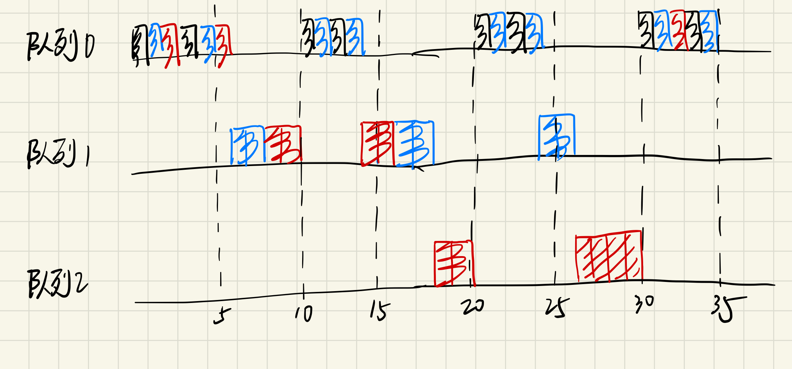
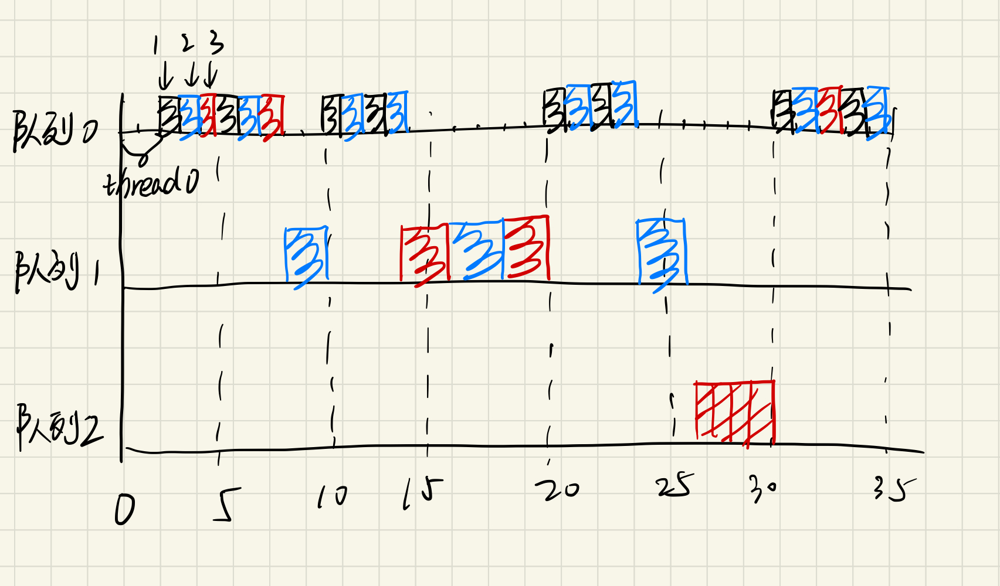

# 测试报告

## 多分区调度

### 抢占式优先级调度

在`test-case/partitions_fp`中实现。

创建两个分区：

```yaml
kernel:
    features: [debug]
    partition_sched: fp
    scheduler:
        slots:
            - partition: pr1
              period: 3s
              complete_time: 2s
              deadline: 3s
              priority: 1
            - partition: pr2
              period: 3s
              complete_time: 1s
              deadline: 3s
              priority: 2
```

运行结果如下：

```
[P2] thread create returns=0
P2T1: now 1382850 ns, 0 s
P2T1: now 102026673 ns, 0 s
P2T1: now 203011599 ns, 0 s
P2T1: now 304005744 ns, 0 s
P2T1: now 405018327 ns, 0 s
P2T1: now 506003253 ns, 0 s
P2T1: now 607015836 ns, 0 s
P2T1: now 708000762 ns, 0 s
P2T1: now 809004126 ns, 0 s
P2T1: now 910007490 ns, 0 s
[P1] pok_thread_create (1) return=0
P1T1: now 1305908226 ns, 1 s
P1T1: now 1407022218 ns, 1 s
P1T1: now 1508007144 ns, 1 s
P1T1: now 1609001289 ns, 1 s
P1T1: now 1710004653 ns, 1 s
P1T1: now 1811017236 ns, 1 s
P1T1: now 1912002162 ns, 1 s
P1T1: now 2013005526 ns, 2 s
P1T1: now 2114008890 ns, 2 s
P1T1: now 2215003035 ns, 2 s
P1T1: now 2316006399 ns, 2 s
P1T1: now 2417000544 ns, 2 s
P1T1: now 2518022346 ns, 2 s
P1T1: now 2619016491 ns, 2 s
P1T1: now 2720001417 ns, 2 s
P1T1: now 2821014000 ns, 2 s
P1T1: now 2922008145 ns, 2 s
P2T1: now 3000010104 ns, 3 s
P2T1: now 3101004249 ns, 3 s
P2T1: now 3202007613 ns, 3 s
P2T1: now 3303001758 ns, 3 s
P2T1: now 3404005122 ns, 3 s
P2T1: now 3505008486 ns, 3 s
P2T1: now 3606002631 ns, 3 s
P2T1: now 3707005995 ns, 3 s
P2T1: now 3808000140 ns, 3 s
P2T1: now 3909012723 ns, 3 s
P1T1: now 4000013472 ns, 4 s
P1T1: now 4101016836 ns, 4 s
P1T1: now 4202001762 ns, 4 s
P1T1: now 4303005126 ns, 4 s
P1T1: now 4404008490 ns, 4 s
P1T1: now 4505011854 ns, 4 s
P1T1: now 4606005999 ns, 4 s
P1T1: now 4707000144 ns, 4 s
P1T1: now 4808003508 ns, 4 s
P1T1: now 4909006872 ns, 4 s
P1T1: now 5010001017 ns, 5 s
P1T1: now 5111004381 ns, 5 s
P1T1: now 5212007745 ns, 5 s
P1T1: now 5313001890 ns, 5 s
P1T1: now 5414005254 ns, 5 s
P1T1: now 5515008618 ns, 5 s
P1T1: now 5616002763 ns, 5 s
P1T1: now 5717006127 ns, 5 s
P1T1: now 5818018710 ns, 5 s
P1T1: now 5919012855 ns, 5 s
P2T1: now 6000010989 ns, 6 s
P2T1: now 6101014353 ns, 6 s
P2T1: now 6202008498 ns, 6 s
P2T1: now 6303002643 ns, 6 s
P2T1: now 6404006007 ns, 6 s
P2T1: now 6505000152 ns, 6 s
P2T1: now 6606003516 ns, 6 s
P2T1: now 6707006880 ns, 6 s
P2T1: now 6808001025 ns, 6 s
P2T1: now 6909004389 ns, 6 s
```

可以看到，在每个3秒周期内，优先级较高的分区2均首先运行1秒到完成当周期运行后，优先级较低的分区1才能运行剩余的2秒。

### 抢占式EDF调度

在`test-case/partitions_edf`中实现。

定义三个分区：

```yaml
kernel:
    features: [debug]
    partition_sched: edf
    scheduler:
        slots:
            - partition: pr1
              period: 6s
              complete_time: 1s
              deadline: 6s
            - partition: pr2
              period: 4s
              complete_time: 2s
              deadline: 4s
            - partition: pr2
              period: 3s
              complete_time: 1s
              deadline: 3s
```

运行结果如下：

```
[P2] thread create returns=0
P3T1: now 1401288 ns, 0 s
P3T1: now 102045111 ns, 0 s
P3T1: now 203011599 ns, 0 s
P3T1: now 304014963 ns, 0 s
P3T1: now 405027546 ns, 0 s
P3T1: now 506012472 ns, 0 s
P3T1: now 607015836 ns, 0 s
P3T1: now 708019200 ns, 0 s
P3T1: now 809013345 ns, 0 s
P3T1: now 910016709 ns, 0 s
[P2] thread create returns=0
P2T1: now 1001579817 ns, 1 s
P2T1: now 1103034912 ns, 1 s
P2T1: now 1204001400 ns, 1 s
P2T1: now 1305004764 ns, 1 s
P2T1: now 1406008128 ns, 1 s
P2T1: now 1507002273 ns, 1 s
P2T1: now 1608005637 ns, 1 s
P2T1: now 1709009001 ns, 1 s
P2T1: now 1810003146 ns, 1 s
P2T1: now 1911006510 ns, 1 s
P2T1: now 2012000655 ns, 2 s
P2T1: now 2113013238 ns, 2 s
P2T1: now 2214016602 ns, 2 s
P2T1: now 2315010747 ns, 2 s
P2T1: now 2416004892 ns, 2 s
P2T1: now 2517017475 ns, 2 s
P2T1: now 2618011620 ns, 2 s
P2T1: now 2719005765 ns, 2 s
P2T1: now 2820009129 ns, 2 s
P2T1: now 2921003274 ns, 2 s
[P1] pok_thread_create (1) return=0
P1T1: now 3441397386 ns, 3 s
P1T1: now 3542031990 ns, 3 s
P1T1: now 3643007697 ns, 3 s
P1T1: now 3744011061 ns, 3 s
P1T1: now 3845005206 ns, 3 s
P1T1: now 3946008570 ns, 3 s
P3T1: now 4001027562 ns, 4 s
P3T1: now 4102012488 ns, 4 s
P3T1: now 4203006633 ns, 4 s
P3T1: now 4304000778 ns, 4 s
P3T1: now 4405004142 ns, 4 s
P3T1: now 4506016725 ns, 4 s
P3T1: now 4607010870 ns, 4 s
P3T1: now 4708014234 ns, 4 s
P3T1: now 4809008379 ns, 4 s
P3T1: now 4910002524 ns, 4 s
P2T1: now 5002017363 ns, 5 s
P2T1: now 5103011508 ns, 5 s
P2T1: now 5204005653 ns, 5 s
P2T1: now 5305009017 ns, 5 s
P2T1: now 5406003162 ns, 5 s
P2T1: now 5507015745 ns, 5 s
P2T1: now 5608009890 ns, 5 s
P2T1: now 5709004035 ns, 5 s
P2T1: now 5810007399 ns, 5 s
P2T1: now 5911001544 ns, 5 s
P2T1: now 6012004908 ns, 6 s
P2T1: now 6113008272 ns, 6 s
P2T1: now 6214002417 ns, 6 s
P2T1: now 6315015000 ns, 6 s
P2T1: now 6416009145 ns, 6 s
P2T1: now 6517003290 ns, 6 s
P2T1: now 6618006654 ns, 6 s
P2T1: now 6719010018 ns, 6 s
P2T1: now 6820004163 ns, 6 s
P2T1: now 6921007527 ns, 6 s
P3T1: now 7003010532 ns, 7 s
P3T1: now 7104004677 ns, 7 s
P3T1: now 7205008041 ns, 7 s
P3T1: now 7306002186 ns, 7 s
P3T1: now 7407005550 ns, 7 s
P3T1: now 7508008914 ns, 7 s
P3T1: now 7609012278 ns, 7 s
P3T1: now 7710006423 ns, 7 s
P3T1: now 7811000568 ns, 7 s
P3T1: now 7912003932 ns, 7 s
P1T1: now 8003013900 ns, 8 s
P1T1: now 8104026483 ns, 8 s
P1T1: now 8205020628 ns, 8 s
P1T1: now 8306014773 ns, 8 s
P1T1: now 8407008918 ns, 8 s
P1T1: now 8508003063 ns, 8 s
P1T1: now 8609006427 ns, 8 s
P1T1: now 8710009791 ns, 8 s
P1T1: now 8811022374 ns, 8 s
P1T1: now 8912016519 ns, 8 s
```

可以看到，分区3由于周期最短，所以在0秒时，其deadline也最短，因此第一个运行，随后是分区2和分区3.另外可以注意到，在第7秒，分区2完成第2次运行后，分区3的第3次运行的deadline（第9秒）小于分区2第3次运行（第12秒）和分区1第2次运行（第12秒），因此分区3抢占分区1、2执行，符合EDF调度策略。

### RR和WRR调度

POK支持通过在`de`中配置slot来实现对partition的RR和Weighted RR调度。

通过为三个partition配置相同比例的slot，可以实现RR调度。
```
#define POK_CONFIG_SCHEDULING_SLOTS {1000,1000,1000}
#define POK_CONFIG_SCHEDULING_SLOTS_ALLOCATION {0,1,2}
#define POK_CONFIG_SCHEDULING_NBSLOTS 3
```
具体的调度结果如下所示，依次调度了P2、P3和P1：

```
P2T1: now 11000009391 ns, 11 s
P3T1: now 11500020294 ns, 11 s
P1T1: now 12000031197 ns, 12 s
P2T1: now 12500023662 ns, 12 s
P3T1: now 13000034565 ns, 13 s
P1T1: now 13500027030 ns, 13 s
P2T1: now 14000019495 ns, 14 s
P3T1: now 14500039617 ns, 14 s
P1T1: now 15000022863 ns, 15 s
...
```

通过将P1、P2和P3的slot设置为1：2：3的比例，可以实现Weighted RR的调度。

```
#define POK_CONFIG_SCHEDULING_SLOTS {1000,1000,1000,1000,1000,1000}
#define POK_CONFIG_SCHEDULING_SLOTS_ALLOCATION {2,1,0,2,1,2}
#define POK_CONFIG_SCHEDULING_NBSLOTS 6
```

具体的调度结果如下所示，依次调度了P3、P2、P1、P3、P2、P3：

```
P3T1: now 1500032709 ns, 1 s
P2T1: now 2000034393 ns, 2 s
P1T1: now 2500072953 ns, 2 s
P3T1: now 3000019323 ns, 3 s
P2T1: now 3500030226 ns, 3 s
P3T1: now 4000041129 ns, 4 s
P3T1: now 4500015156 ns, 4 s
P2T1: now 5000016840 ns, 5 s
P1T1: now 5500027743 ns, 5 s
P3T1: now 6000038646 ns, 6 s
...
```
## 多线程调度

### 抢占式优先级调度

在`test-case/multi_thread_prio`中实现。

创建了三个线程
- thread1: prio = 99, time_capacity = 100
- thread2: prio = 50, time_capacity = 200
- thread3: prio = 20, time_capacity = 300

运行结果如下：
```
Thread 0.1 scheduled at 60
...
Thread 0.1 running at 160
Thread 0.1 finished at 160, next activation: 1000
Thread 0.2 scheduled at 160
Thread 0.2 running at 180
...
Thread 0.2 running at 360
Thread 0.2 finished at 360, next activation: 1000
Thread 0.3 scheduled at 360
Thread 0.3 running at 380
...
Thread 0.3 running at 660
Thread 0.3 finished at 660, next activation: 1000
Thread 0.4 scheduled at 660
Thread 0.1 scheduled at 1000
...
```
可以看到优先级最高的`thread 0.1`先运行，它的时间片运行完后开始调度优先级第二的`thread 0.2`，接着调度`thread 0.3`。注意到，tick=1000的时候`thread 0.1`重新开始调度。

### 抢占式 EDF 调度

在`test-case/multi_thread_prio`中实现。

创建了三个线程
- thread1: deadline = 1000, time_capacity = 100
- thread2: deadline = 600, time_capacity = 200
- thread3: deadline = 500, time_capacity = 300

运行结果如下：

```
Thread 0.3 scheduled at 80
Thread 0.3 running at 100
...
Thread 0.3 running at 380
Thread 0.3 finished at 380, deadline met, next activation: 1000
Thread 0.2 scheduled at 380
Thread 0.2 running at 400
...
Thread 0.2 running at 580
Thread 0.2 finished at 580, deadline met, next activation: 1000
Thread 0.1 scheduled at 580
Thread 0.1 running at 600
...
Thread 0.1 running at 680
Thread 0.1 finished at 680, deadline met, next activation: 1000
Thread 0.4 scheduled at 680
```

可以看到，系统优先调度了优先级最高的`thread 0.3`线程，接着依次调度了`thread 0.2`和`thread 0.1`线程，所有线程都在deadline结束前完成。

### Round-Robin 调度

在`test-case/multi_thread_rr`中实现。完整示例输出在该目录下保存为`output.log.txt`。

创建了三个线程，分别配置为：
- thread1: period = 1000, time_capacity = 500
- thread2: period = 1000, time_capacity = 200
- thread3: period = 1000, time_capacity = 100

运行结果如下：
```
POK kernel initialized
Thread 0.0 scheduled at 20
    SCHED_INFO: sched_time: 0 - 1, thread_id: 0, time_cap: -1, remain_cap: -1, state: 0
Thread 0.1 scheduled at 46
    SCHED_INFO: sched_time: 1 - 2, thread_id: 1, time_cap: 500, remain_cap: 500, state: 1
Thread 0.1 running at 60
Thread 0.2 scheduled at 60
    SCHED_INFO: sched_time: 2 - 3, thread_id: 2, time_cap: 200, remain_cap: 200, state: 1
Thread 0.2 running at 80
Thread 0.3 scheduled at 80
    SCHED_INFO: sched_time: 3 - 4, thread_id: 3, time_cap: 100, remain_cap: 100, state: 1
Thread 0.3 running at 100
Thread 0.1 scheduled at 100
    SCHED_INFO: sched_time: 4 - 5, thread_id: 1, time_cap: 500, remain_cap: 480, state: 1
Thread 0.1 running at 120
Thread 0.2 scheduled at 120
    SCHED_INFO: sched_time: 5 - 6, thread_id: 2, time_cap: 200, remain_cap: 180, state: 1
Thread 0.2 running at 140
Thread 0.3 scheduled at 140
    SCHED_INFO: sched_time: 6 - 7, thread_id: 3, time_cap: 100, remain_cap: 80, state: 1
Thread 0.3 running at 160
Thread 0.1 scheduled at 160
    SCHED_INFO: sched_time: 7 - 8, thread_id: 1, time_cap: 500, remain_cap: 460, state: 1
Thread 0.1 running at 180
Thread 0.2 scheduled at 180
    SCHED_INFO: sched_time: 8 - 9, thread_id: 2, time_cap: 200, remain_cap: 160, state: 1
Thread 0.2 running at 200
...


Thread 0.3 scheduled at 320
    SCHED_INFO: sched_time: 15 - 16, thread_id: 3, time_cap: 100, remain_cap: 20, state: 1
Thread 0.3 running at 340
Thread 0.3 finished at 340, next activation: 1000
Thread 0.1 scheduled at 340
    SCHED_INFO: sched_time: 16 - 17, thread_id: 1, time_cap: 500, remain_cap: 400, state: 1
Thread 0.1 running at 360
Thread 0.2 scheduled at 360
    SCHED_INFO: sched_time: 17 - 18, thread_id: 2, time_cap: 200, remain_cap: 100, state: 1
Thread 0.2 running at 380
Thread 0.1 scheduled at 380
    SCHED_INFO: sched_time: 18 - 19, thread_id: 1, time_cap: 500, remain_cap: 380, state: 1
Thread 0.1 running at 400
Thread 0.2 scheduled at 400
    SCHED_INFO: sched_time: 19 - 20, thread_id: 2, time_cap: 200, remain_cap: 80, state: 1
Thread 0.2 running at 420
Thread 0.1 scheduled at 420
    SCHED_INFO: sched_time: 20 - 21, thread_id: 1, time_cap: 500, remain_cap: 360, state: 1
Thread 0.1 running at 440
Thread 0.2 scheduled at 440
    SCHED_INFO: sched_time: 21 - 22, thread_id: 2, time_cap: 200, remain_cap: 60, state: 1
Thread 0.2 running at 460
Thread 0.1 scheduled at 460
    SCHED_INFO: sched_time: 22 - 23, thread_id: 1, time_cap: 500, remain_cap: 340, state: 1
Thread 0.1 running at 480
Thread 0.2 scheduled at 480
    SCHED_INFO: sched_time: 23 - 24, thread_id: 2, time_cap: 200, remain_cap: 40, state: 1
Thread 0.2 running at 500
Thread 0.1 scheduled at 500
    SCHED_INFO: sched_time: 24 - 25, thread_id: 1, time_cap: 500, remain_cap: 320, state: 1
Thread 0.1 running at 520
Thread 0.2 scheduled at 520
    SCHED_INFO: sched_time: 25 - 26, thread_id: 2, time_cap: 200, remain_cap: 20, state: 1
Thread 0.2 running at 540
Thread 0.2 finished at 540, next activation: 1000
Thread 0.1 scheduled at 540
    SCHED_INFO: sched_time: 26 - 27, thread_id: 1, time_cap: 500, remain_cap: 300, state: 1
Thread 0.1 running at 560
    SCHED_INFO: sched_time: 27 - 28, thread_id: 1, time_cap: 500, remain_cap: 280, state: 1
Thread 0.1 running at 580
    SCHED_INFO: sched_time: 28 - 29, thread_id: 1, time_cap: 500, remain_cap: 260, state: 1
Thread 0.1 running at 600
...


```

可以看到`thread 0.1`，`thread 0.2`，`thread 0.3`交替运行，直到`thread 0.3`最先运行完`time-capacity`后，`thread 0.1`，`thread 0.2`交替运行，直到`thread 0.2`也运行完`time-capacity`。注意到，tick=1000的时候`thread 0.1`，`thread 0.2`，`thread 0.3`重新开始调度。

### Weighted-Round-Robin 调度

在`test-case/multi_thread_wrr`中实现。完整示例输出在该目录下保存为`output.log.txt`。

创建了三个线程，分别配置为：
- thread1: period = 1000, time_capacity = 500, weight = 2
- thread2: period = 1000, time_capacity = 200, weight = 1
- thread3: period = 1000, time_capacity = 100, weight = 1

运行结果如下：
```
POK kernel initialized
Thread 0.0 scheduled at 20
    SCHED_INFO: sched_time: 0 - 1, thread_id: 0, time_cap: -1, remain_cap: -1, state: 0
SQY@pok_sched_part_wrr trace: 825
Thread 0.1 scheduled at 48
    SCHED_INFO: sched_time: 1 - 2, thread_id: 1, time_cap: 500, remain_cap: 500, state: 1
Thread 0.1 running at 60
SQY@pok_sched_part_wrr trace: 825
    SCHED_INFO: sched_time: 2 - 3, thread_id: 1, time_cap: 500, remain_cap: 480, state: 1
Thread 0.1 running at 80
SQY@pok_sched_part_wrr trace: 825
Thread 0.2 scheduled at 80
    SCHED_INFO: sched_time: 3 - 4, thread_id: 2, time_cap: 200, remain_cap: 200, state: 1
Thread 0.2 running at 100
SQY@pok_sched_part_wrr trace: 825
Thread 0.3 scheduled at 100
    SCHED_INFO: sched_time: 4 - 5, thread_id: 3, time_cap: 100, remain_cap: 100, state: 1
Thread 0.3 running at 120
SQY@pok_sched_part_wrr trace: 825
Thread 0.1 scheduled at 120
    SCHED_INFO: sched_time: 5 - 6, thread_id: 1, time_cap: 500, remain_cap: 460, state: 1
Thread 0.1 running at 140
SQY@pok_sched_part_wrr trace: 825
    SCHED_INFO: sched_time: 6 - 7, thread_id: 1, time_cap: 500, remain_cap: 440, state: 1
Thread 0.1 running at 160
SQY@pok_sched_part_wrr trace: 825
Thread 0.2 scheduled at 160
    SCHED_INFO: sched_time: 7 - 8, thread_id: 2, time_cap: 200, remain_cap: 180, state: 1
Thread 0.2 running at 180
SQY@pok_sched_part_wrr trace: 825
Thread 0.3 scheduled at 180
    SCHED_INFO: sched_time: 8 - 9, thread_id: 3, time_cap: 100, remain_cap: 80, state: 1
Thread 0.3 running at 200
SQY@pok_sched_part_wrr trace: 825
Thread 0.1 scheduled at 200
    SCHED_INFO: sched_time: 9 - 10, thread_id: 1, time_cap: 500, remain_cap: 420, state: 1
Thread 0.1 running at 220
SQY@pok_sched_part_wrr trace: 825
    SCHED_INFO: sched_time: 10 - 11, thread_id: 1, time_cap: 500, remain_cap: 400, state: 1
Thread 0.1 running at 240
SQY@pok_sched_part_wrr trace: 825
Thread 0.2 scheduled at 240
    SCHED_INFO: sched_time: 11 - 12, thread_id: 2, time_cap: 200, remain_cap: 160, state: 1
Thread 0.2 running at 260
SQY@pok_sched_part_wrr trace: 825
...
```

可以看到`thread 0.1`，`thread 0.2`，`thread 0.3`交替运行，但`thread 0.1`每次连续执行两个调度最小单位（`time-slice`），而`thread 0.2`，`thread 0.3`只执行一个，这体现了权重的不同设置。其他特征均与 Round-Robin调度相同，详情请看`output.log.txt`。

## 动态线程创建

在`test-case/dynamic_thread_create`中实现。完整示例输出在该目录下保存为`output.log.txt`。

示例测试程序使用前文介绍的 Round-Robin 调度策略。在分区启动阶段，只创建两个线程，分别配置为：
- thread1: period = 1000, time_capacity = 200
- thread2: period = 1000, time_capacity = 100

线程2的payload如下代码所示，首先睡眠5s，之后创建一个新线程，紧接着进入循环。
```c
static void create_task() {
    uint32_t tid;
    pok_thread_attr_t tattr;
    memset(&tattr, 0, sizeof(pok_thread_attr_t));

    pok_thread_sleep(5);

    tattr.period = 1000;
    tattr.time_capacity = 500;
    tattr.entry = task;
    tattr.dynamic_created = TRUE;
    pok_thread_create(&tid, &tattr);

    for (;;) {
    }
}
```
被动态创建的线程的配置如下：
- thread3: period = 1000, time_capacity = 500


运行结果如下：
```
POK kernel initialized
Thread 0.0 scheduled at 20
    SCHED_INFO: sched_time: 0 - 1, thread_id: 0, time_cap: -1, remain_cap: -1, state: 0
Thread 0.1 scheduled at 45
    SCHED_INFO: sched_time: 1 - 2, thread_id: 1, time_cap: 200, remain_cap: 200, state: 1
Thread 0.1 running at 60
Thread 0.2 scheduled at 60
    SCHED_INFO: sched_time: 2 - 3, thread_id: 2, time_cap: 100, remain_cap: 100, state: 2
Thread 0.2 running at 66
    SCHED_INFO: sched_time: 3 - 4, thread_id: 1, time_cap: 200, remain_cap: 180, state: 1
Thread 0.1 running at 80
    SCHED_INFO: sched_time: 4 - 5, thread_id: 1, time_cap: 200, remain_cap: 160, state: 1
Thread 0.1 running at 100
    SCHED_INFO: sched_time: 5 - 6, thread_id: 1, time_cap: 200, remain_cap: 140, state: 1
Thread 0.1 running at 120
...


...
    SCHED_INFO: sched_time: 225 - 226, thread_id: 4, time_cap: -1, remain_cap: -1, state: 1
    SCHED_INFO: sched_time: 226 - 227, thread_id: 4, time_cap: -1, remain_cap: -1, state: 1
    SCHED_INFO: sched_time: 227 - 228, thread_id: 4, time_cap: -1, remain_cap: -1, state: 1
    SCHED_INFO: sched_time: 228 - 229, thread_id: 4, time_cap: -1, remain_cap: -1, state: 1
...


...
    SCHED_INFO: sched_time: 253 - 254, thread_id: 1, time_cap: 200, remain_cap: 140, state: 1
Thread 0.1 running at 5080
    SCHED_INFO: sched_time: 254 - 255, thread_id: 1, time_cap: 200, remain_cap: 120, state: 1
Thread 0.1 running at 5100
Thread 0.2 scheduled at 5100
    SCHED_INFO: sched_time: 255 - 256, thread_id: 2, time_cap: 100, remain_cap: 80, state: 1
Thread 0.2 running at 5120
Thread 0.3 scheduled at 5120
    SCHED_INFO: sched_time: 256 - 257, thread_id: 3, time_cap: 500, remain_cap: 500, state: 1
Thread 0.3 running at 5140
Thread 0.1 scheduled at 5140
    SCHED_INFO: sched_time: 257 - 258, thread_id: 1, time_cap: 200, remain_cap: 100, state: 1
Thread 0.1 running at 5160
Thread 0.2 scheduled at 5160
    SCHED_INFO: sched_time: 258 - 259, thread_id: 2, time_cap: 100, remain_cap: 60, state: 1
Thread 0.2 running at 5180
Thread 0.3 scheduled at 5180
    SCHED_INFO: sched_time: 259 - 260, thread_id: 3, time_cap: 500, remain_cap: 480, state: 1
Thread 0.3 running at 5200
Thread 0.1 scheduled at 5200
    SCHED_INFO: sched_time: 260 - 261, thread_id: 1, time_cap: 200, remain_cap: 80, state: 1
Thread 0.1 running at 5220
Thread 0.2 scheduled at 5220
    SCHED_INFO: sched_time: 261 - 262, thread_id: 2, time_cap: 100, remain_cap: 40, state: 1
Thread 0.2 running at 5240
Thread 0.3 scheduled at 5240
    SCHED_INFO: sched_time: 262 - 263, thread_id: 3, time_cap: 500, remain_cap: 460, state: 1
Thread 0.3 running at 5260
Thread 0.1 scheduled at 5260
    SCHED_INFO: sched_time: 263 - 264, thread_id: 1, time_cap: 200, remain_cap: 60, state: 1
Thread 0.1 running at 5280
Thread 0.2 scheduled at 5280
    SCHED_INFO: sched_time: 264 - 265, thread_id: 2, time_cap: 100, remain_cap: 20, state: 1
Thread 0.2 running at 5300
Thread 0.2 finished at 5300, next activation: 1000
Thread 0.3 scheduled at 5300
    SCHED_INFO: sched_time: 265 - 266, thread_id: 3, time_cap: 500, remain_cap: 440, state: 1
Thread 0.3 running at 5320
```

可以看到`thread 0.2`在第一次被调度后立即进入睡眠，只剩`thread 0.1`独自运行，在`thread 0.1`的time-capacity用完后，idle线程（即`thread 0.4`）开始运行直到周期结束。

直到5s后（`5000 ticks`），`thread 0.2`醒来被调度，然后创建了`thread 0.3`开始运行、参与调度。之后的运行特征均与 Round-Robin调度相同，`thread 0.1`，`thread 0.2`，`thread 0.3`交替运行，详情请看`output.log.txt`。

## 多级反馈队列调度算法

### 使用 Python 实现的 MLFQ 算法模拟简述

我们运行并测试了Python算法模拟，程序开始运行时会首先获取用户对系统资源、任务、CPU数、多级队列的配置信息。完整的一次程序运行示例如下：

```
➜ python3 main.py
Tell me about the number of each resource:
    A > 1
    B > 1
    C > 1
How many tasks do exist? 3
    > t1 X 2
    > t2 X 4
    > t3 X 10
How many cpu cores do exist? 1
Please enter the number of the queues: 3
Respectively, enter time quantum associated with each queue: 2 4 8
Respectively, enter time slice(rr budget) associated with each queue: 1 2 4

Task t1 current cputime: 1
Task t1 current state: queue 0

Task t2 current cputime: 1
Task t2 current state: queue 0

Task t3 current cputime: 1
Task t3 current state: queue 0

Task t1 current cputime: 2
Task t1 current state: done

Task t2 current cputime: 2
Task t2 current state: queue 1

Task t3 current cputime: 2
Task t3 current state: queue 1

Task t2 current cputime: 4
Task t2 current state: done

Task t3 current cputime: 4
Task t3 current state: queue 1

Task t3 current cputime: 6
Task t3 current state: queue 2

Task t3 current cputime: 10
Task t3 current state: done

.: CPU Cores Status :.
core 1: 16 secs!
Total CPU time: 16 secs!

```

可以看到任务初始时都在最高优先级，队列内以RR进行调度，轮转时间片为用户设置的每个队列对应的`time slice(rr budget)`，当任务运行时间达到所处队列的最长运行时间`time quantum`时，会进入低优先级队列。

### 在 POK 中支持 MLFQ 调度策略

我们用示例场景测试了调度实现的正确性，该示例与设计报告中相同。我们认为该示例能体现调度效果，即保证短任务的优先执行以达到较短的周转时间，按时提高所有任务优先级以应对任务类型的动态变化：



以上示例场景中共有三个任务，任务1、2、3在图中分别用黑色、蓝色和红色表示。其中任务1、2为周期性任务，周期为10s，任务1完成需要的时间为2s，任务2完成需要4s。任务3为长期批处理任务。

图中描述了各任务所在的队列及执行情况，开始时，任务1、2、3均处在最高优先级队列（即队列0），以RR方式执行两轮后，任务1完成，任务2、3进入队列1执行，任务2执行一个轮转时间片后也完成。在10s时，任务1、2在新的周期进入调度，以RR方式执行，两轮后任务1结束，任务2进入队列1。任务3在此后才被调度，再执行一个轮转时间片后进入队列2（最低优先级）。直到30s时，触发Boost，所有任务又重新进入队列0中。

而在POK中，由于创建所有其他线程的主任务也要在最初参与调度，占用两个调度时间片，因此对应设置下的调度情况应为：



我们的测试在`test-case/multi_thread_mlfq`中实现。完整示例输出在该目录下保存为`output.log.txt`。

在分区启动阶段，创建三个线程，分别配置为（由于调度时间片为 20 tick，周期为10次调度即 200 tick，其他类推）（time_capacity 设置为 -1 表示该任务永不结束）：
- thread1: period = 200, time_capacity = 40
- thread2: period = 200, time_capacity = 80
- thread3: time_capacity = -1

多级队列设置为（单位为调度时间片）：
- list0: time_slice = 1, time_allotment = 2
- list1: time_slice = 2, time_allotment = 4
- list2: time_slice = 4, time_allotment = --

运行结果如下：
```
POK kernel initialized
Thread 0.0 scheduled at 20
    SCHED_INFO: sched_time: 0 - 1, thread_id: 0, time_cap: -1, remain_cap: -1, state: 0
SQY@pok_sched_part_mlfq trace: 700, ready for queue moving. 
SQY@pok_sched_part_mlfq q_id: 0, queue: 1 - 2 - 3 - 0 - 
SQY@pok_sched_part_mlfq q_id: 1, queue: 
SQY@pok_sched_part_mlfq q_id: 2, queue: 
SQY@pok_sched_part_mlfq trace: 743
SQY@pok_sched_part_mlfq q_id: 0, queue: 1 - 
--- scheduling partition: 0, low:0, high:4
--- Scheduling processor: 0
    scheduling thread 1 (priority 0)
elected 1 !!! 
    other ready:  2 (0), 3 (0)
    non-ready: 0 (1/stopped)
Thread 0.1 scheduled at 47
    SCHED_INFO: sched_time: 1 - 2, thread_id: 1, time_cap: 40, remain_cap: 40, state: 1
Thread 0.1 running at 60
SQY@pok_sched_part_mlfq trace: 700, ready for queue moving. 
SQY@pok_sched_part_mlfq q_id: 0, queue: 2 - 3 - 0 - 1 - 
SQY@pok_sched_part_mlfq q_id: 1, queue: 
SQY@pok_sched_part_mlfq q_id: 2, queue: 
SQY@pok_sched_part_mlfq trace: 743
SQY@pok_sched_part_mlfq q_id: 0, queue: 2 - 
--- scheduling partition: 0, low:0, high:4
--- Scheduling processor: 0
    scheduling thread 2 (priority 0)
    other ready:  1 (0)elected 2 !!! 
, 3 (0)
    non-ready: 0 (1/stopped)
Thread 0.2 scheduled at 60
    SCHED_INFO: sched_time: 2 - 3, thread_id: 2, time_cap: 80, remain_cap: 80, state: 1
Thread 0.2 running at 80
SQY@pok_sched_part_mlfq trace: 700, ready for queue moving. 
SQY@pok_sched_part_mlfq q_id: 0, queue: 3 - 0 - 1 - 2 - 
SQY@pok_sched_part_mlfq q_id: 1, queue: 
SQY@pok_sched_part_mlfq q_id: 2, queue: 
SQY@pok_sched_part_mlfq trace: 743
SQY@pok_sched_part_mlfq q_id: 0, queue: 3 - 
--- scheduling partition: 0, low:0, high:4
--- Scheduling processor: 0
    scheduling thread 3 (priority 0)
    other ready:  1 (0), 2 (0)elected 3 !!! 

    non-ready: 0 (1/stopped)
Thread 0.3 scheduled at 80
    SCHED_INFO: sched_time: 3 - 4, thread_id: 3, time_cap: -1, remain_cap: -1, state: 1
SQY@pok_sched_part_mlfq trace: 700, ready for queue moving. 
SQY@pok_sched_part_mlfq q_id: 0, queue: 0 - 1 - 2 - 3 - 
SQY@pok_sched_part_mlfq q_id: 1, queue: 
SQY@pok_sched_part_mlfq q_id: 2, queue: 
SQY@pok_sched_part_mlfq trace: 743
SQY@pok_sched_part_mlfq q_id: 0, queue: 0 - 1 - 
--- scheduling partition: 0, low:0, high:4
--- Scheduling processor: 0
    scheduling thread 1 (priority 0)
elected 1 !!! 
    other ready:  2 (0), 3 (0)
    non-ready: 0 (1/stopped)
Thread 0.1 scheduled at 100
    SCHED_INFO: sched_time: 4 - 5, thread_id: 1, time_cap: 40, remain_cap: 20, state: 1
Thread 0.1 running at 120
Thread 0.1 finished at 120, next activation: 200
SQY@pok_sched_part_mlfq trace: 700, ready for queue moving. 
SQY@pok_sched_part_mlfq q_id: 0, queue: 0 - 2 - 3 - 
SQY@pok_sched_part_mlfq q_id: 1, queue: 1 - 
SQY@pok_sched_part_mlfq q_id: 2, queue: 
SQY@pok_sched_part_mlfq trace: 743
SQY@pok_sched_part_mlfq q_id: 0, queue: 0 - 2 - 
--- scheduling partition: 0, low:0, high:4
--- Scheduling processor: 0
    scheduling thread 2 (priority 0)
elected 2 !!! 
    other ready:  3 (0)
    non-ready: 0 (1/stopped), 1 (0/waiting next activation)
Thread 0.2 scheduled at 120
    SCHED_INFO: sched_time: 5 - 6, thread_id: 2, time_cap: 80, remain_cap: 60, state: 1
Thread 0.2 running at 140
SQY@pok_sched_part_mlfq trace: 700, ready for queue moving. 
SQY@pok_sched_part_mlfq q_id: 0, queue: 0 - 3 - 
SQY@pok_sched_part_mlfq q_id: 1, queue: 1 - 2 - 
SQY@pok_sched_part_mlfq q_id: 2, queue: 
SQY@pok_sched_part_mlfq trace: 743
SQY@pok_sched_part_mlfq q_id: 0, queue: 0 - 3 - 
--- scheduling partition: 0, low:0, high:4
--- Scheduling processor: 0
    scheduling thread 3 (priority 0)
    other ready:  2 (0)elected 3 !!! 

    non-ready: 0 (1/stopped), 1 (0/waiting next activation)
Thread 0.3 scheduled at 140
    SCHED_INFO: sched_time: 6 - 7, thread_id: 3, time_cap: -1, remain_cap: -1, state: 1
SQY@pok_sched_part_mlfq trace: 700, ready for queue moving. 
SQY@pok_sched_part_mlfq q_id: 0, queue: 0 - 
SQY@pok_sched_part_mlfq q_id: 1, queue: 1 - 2 - 3 - 
SQY@pok_sched_part_mlfq q_id: 2, queue: 
SQY@pok_sched_part_mlfq trace: 743
SQY@pok_sched_part_mlfq q_id: 0, queue: 0 - 
SQY@pok_sched_part_mlfq q_id: 1, queue: 1 - 2 - 
--- scheduling partition: 0, low:0, high:4
--- Scheduling processor: 0
    scheduling thread 2 (priority 0)
elected 2 !!! 
    other ready:  3 (0)
    non-ready: 0 (1/stopped), 1 (0/waiting next activation)
Thread 0.2 scheduled at 160
    SCHED_INFO: sched_time: 7 - 8, thread_id: 2, time_cap: 80, remain_cap: 40, state: 1
Thread 0.2 running at 180
SQY@pok_sched_part_mlfq trace: 700, ready for queue moving. 
SQY@pok_sched_part_mlfq q_id: 0, queue: 0 - 
SQY@pok_sched_part_mlfq q_id: 1, queue: 1 - 2 - 3 - 
SQY@pok_sched_part_mlfq q_id: 2, queue: 
SQY@pok_sched_part_mlfq trace: 743
SQY@pok_sched_part_mlfq q_id: 0, queue: 0 - 
SQY@pok_sched_part_mlfq q_id: 1, queue: 1 - 2 - 
    SCHED_INFO: sched_time: 8 - 9, thread_id: 2, time_cap: 80, remain_cap: 20, state: 1
Thread 0.2 running at 200
Thread 0.2 finished at 200, next activation: 200
SQY@pok_sched_part_mlfq trace: 700, ready for queue moving. 
SQY@pok_sched_part_mlfq q_id: 0, queue: 0 - 1 - 
SQY@pok_sched_part_mlfq q_id: 1, queue: 3 - 2 - 
SQY@pok_sched_part_mlfq q_id: 2, queue: 
SQY@pok_sched_part_mlfq trace: 743
SQY@pok_sched_part_mlfq q_id: 0, queue: 0 - 1 - 
--- scheduling partition: 0, low:0, high:4
--- Scheduling processor: 0
    scheduling thread 1 (priority 0)
elected 1 !!! 
    other ready:  3 (0)
    non-ready: 0 (1/stopped), 2 (0/waiting next activation)
Thread 0.1 scheduled at 200
    SCHED_INFO: sched_time: 9 - 10, thread_id: 1, time_cap: 40, remain_cap: 40, state: 1
Thread 0.1 running at 220
SQY@pok_sched_part_mlfq trace: 700, ready for queue moving. 
SQY@pok_sched_part_mlfq q_id: 0, queue: 0 - 2 - 1 - 
SQY@pok_sched_part_mlfq q_id: 1, queue: 3 - 
SQY@pok_sched_part_mlfq q_id: 2, queue: 
SQY@pok_sched_part_mlfq trace: 743
SQY@pok_sched_part_mlfq q_id: 0, queue: 0 - 2 - 
--- scheduling partition: 0, low:0, high:4
--- Scheduling processor: 0
    scheduling thread 2 (priority 0)
    other ready:  1 (0)elected 2 !!! 
, 3 (0)
    non-ready: 0 (1/stopped)
Thread 0.2 scheduled at 220
    SCHED_INFO: sched_time: 10 - 11, thread_id: 2, time_cap: 80, remain_cap: 80, state: 1
Thread 0.2 running at 240
SQY@pok_sched_part_mlfq trace: 700, ready for queue moving. 
SQY@pok_sched_part_mlfq q_id: 0, queue: 0 - 1 - 2 - 
SQY@pok_sched_part_mlfq q_id: 1, queue: 3 - 
SQY@pok_sched_part_mlfq q_id: 2, queue: 
SQY@pok_sched_part_mlfq trace: 743
SQY@pok_sched_part_mlfq q_id: 0, queue: 0 - 1 - 
--- scheduling partition: 0, low:0, high:4
--- Scheduling processor: 0
    scheduling thread 1 (priority 0)
elected 1 !!! 
    other ready:  2 (0), 3 (0)
    non-ready: 0 (1/stopped)
...


```

可以看到我们在每次调度时输出了各队列中任务的情况，以及选取队列中满足调度条件的任务的过程。我们的输出结果与图中分析的调度过程完全一致（这里只展示了前期的部分，完整请参考`output.log.txt`），可认为在一般情况下实现正确。

## 新场景调度

在`test-case/multi_thread_ipcp`中实现。

定义了三个线程，其中高优先级线程优先级为100，中优先级线程为50，低优先级线程为1.为了模拟优先级反转场景，我们让高优先级线程在第5秒开始运行，中优先级线程在第3秒开始运行，低优先级线程立刻开始运行。

在未启用优先级置顶协议时，低优先级线程将会立刻尝试获取与高优先级线程共享的资源访问权（锁），随后中优先级线程开始运行，高优先级线程将会被二者阻塞到第15秒才开始运行，如下所示：

```
pok_mutex_create return=0, mid=0
low_prio_job: mutex lock, ret=0
low_prio_job: I'm alive at 501559695
low_prio_job: I'm alive at 1001561379
low_prio_job: I'm alive at 1501563063
low_prio_job: I'm alive at 2001564747
low_prio_job: I'm alive at 2501566431
low_prio_job: I'm alive at 3001568115
medium_prio_job: I'm alive at 3502030749
medium_prio_job: I'm alive at 4002032433
medium_prio_job: I'm alive at 4502034117
medium_prio_job: I'm alive at 5002035801
medium_prio_job: I'm alive at 5502037485
medium_prio_job: I'm alive at 6002039169
medium_prio_job: I'm alive at 6502040853
medium_prio_job: I'm alive at 7002042537
medium_prio_job: I'm alive at 7502044221
medium_prio_job: I'm alive at 8002045905
low_prio_job: I'm alive at 8002101219
low_prio_job: I'm alive at 8502102903
low_prio_job: I'm alive at 9002104587
low_prio_job: I'm alive at 9502106271
low_prio_job: I'm alive at 10002107955
low_prio_job: I'm alive at 10502109639
low_prio_job: I'm alive at 11002111323
low_prio_job: I'm alive at 11502113007
low_prio_job: I'm alive at 12002114691
low_prio_job: I'm alive at 12502116375
low_prio_job: I'm alive at 13002118059
low_prio_job: I'm alive at 13502119743
low_prio_job: I'm alive at 14002121427
low_prio_job: I'm alive at 14502123111
high_prio_job: mutex lock, ret=0
high_prio_job: I'm alive at 14502215301 ns
high_prio_job: mutex unlock, ret=0
low_prio_job: mutex unlock, ret=0
```

启用优先级置顶协议后，低优先级线程在获取锁后优先级将会被立即提升到100，高优先级线程在第10秒即可开始运行，不会被中优先级线程阻塞，如下所示：

```
[DEBUG] set lock obj 0 ceiling_value to 100
pok_mutex_create return=0, mid=0
[DEBUG] ceil priority of thread 3 to 100, original=1
low_prio_job: mutex lock, ret=0
low_prio_job: I'm alive at 501587352
low_prio_job: I'm alive at 1001589036
low_prio_job: I'm alive at 1501590720
low_prio_job: I'm alive at 2001592404
low_prio_job: I'm alive at 2501594088
low_prio_job: I'm alive at 3001595772
low_prio_job: I'm alive at 3501597456
low_prio_job: I'm alive at 4001599140
low_prio_job: I'm alive at 4501600824
low_prio_job: I'm alive at 5001602508
low_prio_job: I'm alive at 5501604192
low_prio_job: I'm alive at 6001605876
low_prio_job: I'm alive at 6501607560
low_prio_job: I'm alive at 7001609244
low_prio_job: I'm alive at 7501610928
low_prio_job: I'm alive at 8001612612
low_prio_job: I'm alive at 8501614296
low_prio_job: I'm alive at 9001615980
low_prio_job: I'm alive at 9501617664
low_prio_job: I'm alive at 10001619348
[DEBUG] unceil priority of thread 3
low_prio_job: mutex unlock, ret=0
[DEBUG] ceil priority of thread 1 to 100, original=100
high_prio_job: mutex lock, ret=0
high_prio_job: I'm alive at 10001794509 ns
[DEBUG] unceil priority of thread 1
high_prio_job: mutex unlock, ret=0
medium_prio_job: I'm alive at 10501897602
medium_prio_job: I'm alive at 11001899286
medium_prio_job: I'm alive at 11501900970
medium_prio_job: I'm alive at 12001902654
medium_prio_job: I'm alive at 12501904338
medium_prio_job: I'm alive at 13001906022
medium_prio_job: I'm alive at 13501907706
medium_prio_job: I'm alive at 14001909390
medium_prio_job: I'm alive at 14501911074
medium_prio_job: I'm alive at 15001912758
```